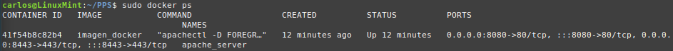
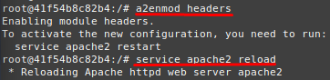
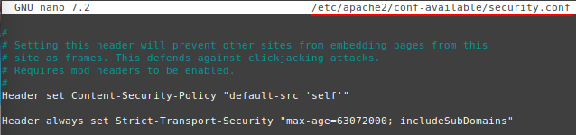
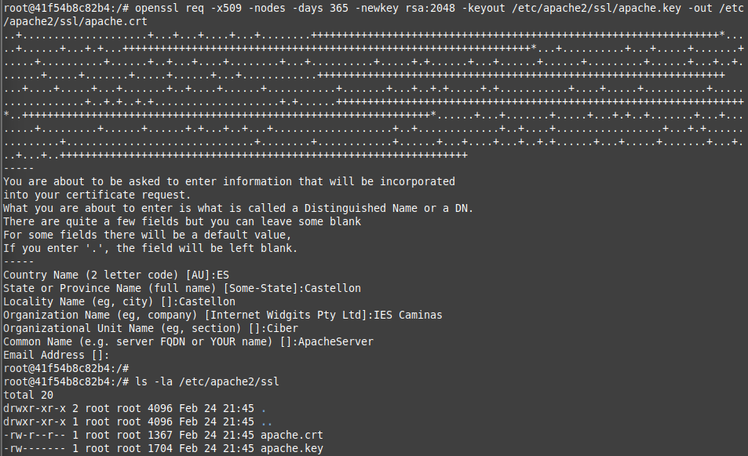
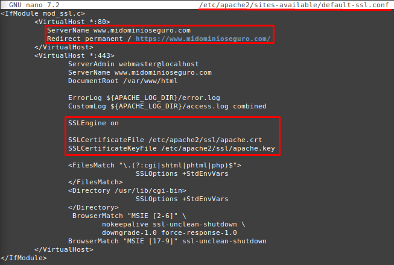
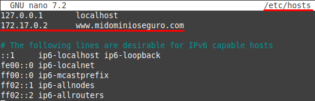
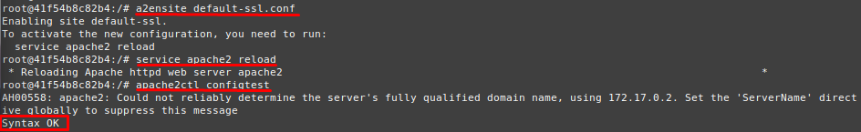
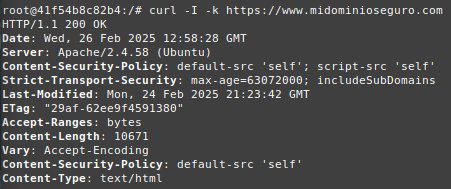
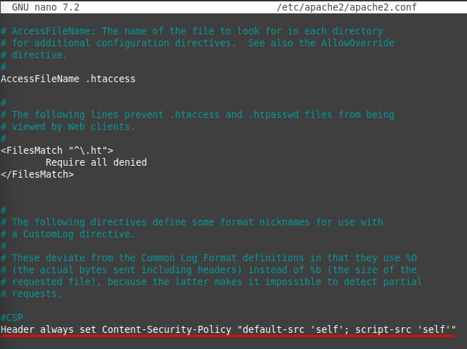
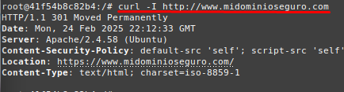

# 🛡️ Apache Hardening con HSTS y CSP

Este repositorio documenta la implementación de **Apache Hardening** utilizando **HSTS (Strict Transport Security)** y **CSP (Content Security Policy)** en un contenedor Docker.

---

## 📌 1. Introducción

La seguridad en servidores web es fundamental para protegerlos de ataques como **MITM (Man-in-the-Middle)** y **XSS (Cross-Site Scripting)**.  

A continuación, se detallan los pasos para **fortalecer Apache** con **HSTS** y **CSP**, garantizando que todas las conexiones sean seguras y restringiendo la carga de contenido potencialmente malicioso.

---

## 🚀 2. Requisitos Previos

Antes de comenzar, previamente debemos haber configurado:
- **Apache corriendo en un contenedor Docker**

Consultamos el ID del contenedor de Apache:
 

E inicializamos el terminal dentro del contenedor, donde vamos a realizar la configuración en su totalidad.
```bash
sudo docker exec -it 41f5 /bin/bash
```

---

## 🔒 3. Implementación de HSTS (Strict Transport Security)

### 📌 ¿Qué es HSTS?

**HSTS** (HTTP Strict Transport Security), es una política de seguridad web establecida para evitar ataques que puedan interceptar comunicaciones, cookies, etc. Según este mecanismo un servidor web declara que los agentes de usuario compatibles (es decir, los navegadores), solamente pueden interactuar con ellos mediante conexiones HTTP seguras (es decir, en HTTP sobre TLS/SSL1). HSTS es un estándar del IETF y se especifica en el RFC 6797.

La política HSTS es comunicada por el servidor al navegador a través de un campo de la cabecera HTTP de respuesta denominado “Strict Transport-Security”. La política HSTS especifica un período de tiempo durante el cual el agente de usuario deberá acceder al servidor sólo en forma segura.

### **1️⃣ Habilitar el módulo `headers` en Apache**
```bash
a2enmod headers
```
 

### **2️⃣ Editar la configuración de Apache**
```bash
nano /etc/apache2/conf-available/security.conf
```

Añadir la siguiente línea para habilitar HSTS:

```apache
Header always set Strict-Transport-Security "max-age=63072000; includeSubDomains"
```
 

### 📌 Explicación de los parámetros:
- **`max-age=63072000`** → HTTPS obligatorio durante **2 años**.
- **`includeSubDomains`** → Aplica HSTS a **todos los subdominios**.

### **3️⃣ Activar la configuración y reiniciar Apache**
```bash
a2enconf security

service apache2 reload
```

### **4️⃣ Antes de verificar que HSTS está activo, debemos certificado nuestro dominio**
Para garantizar que el tráfico cifrado es confiable, necesitamos configurar un certificado digital para nuestro servidor Apache.

---

## 🔒 4. Implementación de un certificado digital en Apache

### 📌 ¿Qué es un certificado digital?

Un **certificado digital** es un documento electrónico que garantiza la identidad de un servidor web y permite establecer conexiones cifradas mediante **SSL/TLS**. Esto asegura que los datos transmitidos entre el servidor y los usuarios sean seguros y no puedan ser interceptados por terceros.

### **1️⃣ Activar el módulo SSL en Apache**
```bash
a2enmod ssl
```

### **2️⃣ Crear un Certificado SSL Auto-firmado**
Generamos un certificado autofirmado válido por 1 año (365 días) con clave de 2048 bits:
```bash
mkdir /etc/apache2/ssl

openssl req -x509 -nodes -days 365 -newkey rsa:2048 -keyout /etc/apache2/ssl/apache.key -out /etc/apache2/ssl/apache.crt
```
Durante la ejecución del comando, introducimos los datos solicitados.
 

### **3️⃣ Configurar Apache para usar el Certificado SSL**
```bash
nano /etc/apache2/sites-available/default-ssl.conf
```
Agregamos la siguiente configuración dentro de `<VirtualHost *:80>`:
```bash
ServerName www.midominioseguro.com
Redirect permanent / https://www.midominioseguro.com/
```
Y tammbién agregamos dentro de `<VirtualHost *:443>` esta configuración:
```bash
SSLEngine on
SSLCertificateFile /etc/apache2/ssl/apache.crt
SSLCertificateKeyFile /etc/apache2/ssl/apache.key
```
 

### **4️⃣ Configurar /etc/hosts**
```bash
nano /etc/hosts
```
 

### **5️⃣ Activar el sitio SSL y reiniciar Apache**
```bash
a2ensite default-ssl.conf

service apache2 reload

apache2ctl configtest
```
 

### **6️⃣ Comprobar el Certificado SSL**

Para verificar que la conexión SSL está activa y el certificado funciona correctamente:
```bash
curl -I -k https://www.midominioseguro.com
```
 

---

## 🛡️ 5. Implementación de CSP (Content Security Policy)

### 📌 ¿Qué es CSP?

CSP (**Content Security Policy**), es una capa de seguridad adicional que ayuda a prevenir y mitigar algunos tipos de ataque, incluyendo Cross Site Scripting ( XSS ) y ataques de inyección de datos. Estos ataques son usados con diversos propósitos, desde robar información hasta desfiguración de sitios o distribución de malware.

### **1️⃣ Editar la configuración de Apache**
```bash
nano /etc/apache2/conf-available/security.conf
```

Añadir la siguiente línea:

```apache
Header set Content-Security-Policy "default-src 'self'; script-src 'self'"
```
 

### 📌 Explicación de los parámetros:
- **`default-src 'self'`** → Solo permite cargar contenido del mismo dominio.

Además, editar también el archivo apache2.conf:
```bash
nano /etc/apache2/apache2.conf
```

Añadir nuevamente la misma política de seguridad:
```apache
Header always set Content-Security-Policy "default-src 'self'; script-src 'self'"
```
 

### **3️⃣ Aplicar la configuración**
```bash
service apache2 reload
```

---

## 🛠️ 6. Validación Final

Para comprobar que **Apache está bien configurado y activo con HSTS y CSP**, usa:
```bash
curl -I http://www.midominioseguro.com
```
 

---

## 📌 7. Imagen de Docker HSTS y CSP
Una vez configurado y probado nuestro WAF con ModSecurity, podemos guardar la imagen y subirla a Docker Hub para reutilizarla en otros entornos.

Primero, identificamos el ID del contenedor donde hemos configurado Apache con ModSecurity.
Hacemos un commit del contenedor en una nueva imagen.
```bash
sudo docker ps
sudo docker commit apache_server pps10219544/imagen_docker:v1
sudo docker push pps10219544/imagen_docker:v1
```

Antes de subir la imagen, iniciamos sesión en Docker Hub:

Si deseamos descargarnos la imagen en otro sistema e inicializar este contenedor:
```bash
sudo docker pull pps10219544/imagen_docker:v1
sudo docker run -d -p 8080:80 -p 8443:443 --name apache_server imagen_docker
```

---

## 📌 8. Conclusión

Este Hardening de Apache con HSTS y CSP proporciona una mayor seguridad para nuestro servidor web. Con esta configuración, logramos:  
✔ **Forzar HTTPS** con **HSTS** para evitar ataques MITM.  
✔ **Restringir carga de contenido externo** y prevenir ataques **XSS** mediante **CSP**.  
✔ **Asegurar la identidad del servidor** con un **Certificado Digital SSL/TLS**.  
✔ **Reducir la superficie de ataque** configurando políticas de seguridad más estrictas en **Apache**.  
