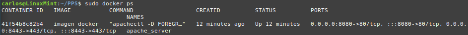

# 🛡️ Apache Hardening con HSTS y CSP

Este repositorio documenta la implementación de **Apache Hardening** utilizando **HSTS (Strict Transport Security)** y **CSP (Content Security Policy)** en un contenedor Docker.

---

## 📌 1. Introducción

La seguridad en servidores web es fundamental para protegerlos de ataques como **MITM (Man-in-the-Middle)** y **XSS (Cross-Site Scripting)**.  

A continuación, se detallan los pasos para **fortalecer Apache** con **HSTS** y **CSP**, garantizando que todas las conexiones sean seguras y restringiendo la carga de contenido potencialmente malicioso.

---

## 🚀 2. Requisitos Previos

Antes de comenzar, previamente debemos haber configurado:
- **Apache corriendo en un contenedor Docker**

Consultamos el ID del contenedor de Apache:
 

E inicializamos el terminal dentro del contenedor, donde vamos a realizar la configuración en su totalidad.
```bash
sudo docker exec -it 41f5 /bin/bash
```

---

## 🔒 3. Implementación de HSTS (Strict Transport Security)

### 📌 ¿Qué es HSTS?

**HSTS** (HTTP Strict Transport Security), es una política de seguridad web establecida para evitar ataques que puedan interceptar comunicaciones, cookies, etc. Según este mecanismo un servidor web declara que los agentes de usuario compatibles (es decir, los navegadores), solamente pueden interactuar con ellos mediante conexiones HTTP seguras (es decir, en HTTP sobre TLS/SSL1). HSTS es un estándar del IETF y se especifica en el RFC 6797.

La política HSTS es comunicada por el servidor al navegador a través de un campo de la cabecera HTTP de respuesta denominado “Strict Transport-Security”. La política HSTS especifica un período de tiempo durante el cual el agente de usuario deberá acceder al servidor sólo en forma segura.

### **1️⃣ Habilitar el módulo `headers` en Apache**
```bash
a2enmod headers
```

### **2️⃣ Editar la configuración de Apache**
```bash
nano /etc/apache2/conf-available/security.conf
```

Añadir la siguiente línea para habilitar HSTS:

```apache
Header always set Strict-Transport-Security "max-age=63072000; includeSubDomains; preload"
```

### 📌 Explicación de los parámetros:
- **`max-age=63072000`** → HTTPS obligatorio durante **2 años**.
- **`includeSubDomains`** → Aplica HSTS a **todos los subdominios**.
- **`preload`** → Permite que el sitio se agregue a la lista **HSTS Preload List**.

### **3️⃣ Activar la configuración y reiniciar Apache**
```bash
a2enconf security
service apache2 reload
```

### **4️⃣ Verificar que HSTS está activo**
```bash
curl -I https://localhost:8443
```

Salida esperada:
```
Strict-Transport-Security: max-age=63072000; includeSubDomains; preload
```

---

## 🛡️ 4. Implementación de CSP (Content Security Policy)

### 📌 ¿Qué es CSP?

CSP (**Content Security Policy**), es una capa de seguridad adicional que ayuda a prevenir y mitigar algunos tipos de ataque, incluyendo Cross Site Scripting ( XSS ) y ataques de inyección de datos. Estos ataques son usados con diversos propósitos, desde robar información hasta desfiguración de sitios o distribución de malware.

### **1️⃣ Editar la configuración de Apache**
```bash
nano /etc/apache2/conf-available/security.conf
```

Añadir la siguiente línea:

```apache
Header set Content-Security-Policy "default-src 'self'; script-src 'self' https://apis.google.com"
```

### 📌 Explicación de los parámetros:
- **`default-src 'self'`** → Solo permite cargar contenido del mismo dominio.
- **`script-src 'self' https://apis.google.com`** → Solo permite scripts del dominio y Google APIs.

### **2️⃣ Aplicar la configuración**
```bash
service apache2 reload
```

### **3️⃣ Verificar que CSP está activo**
```bash
curl -I https://localhost:8443
```

Salida esperada:
```
Content-Security-Policy: default-src 'self'; script-src 'self' https://apis.google.com
```

---

## 🛠️ 5. Validación Final

Para comprobar que **Apache está bien configurado con HSTS y CSP**, usa:

```bash
curl -I https://localhost:8443
```

Salida esperada:
```
Strict-Transport-Security: max-age=63072000; includeSubDomains; preload
Content-Security-Policy: default-src 'self'; script-src 'self' https://apis.google.com
```

---

## 📌 6. Subir la imagen a Docker Hub

```bash
sudo docker ps
sudo docker commit apache_server pps10219544/imagen_docker:v1
sudo docker push pps10219544/imagen_docker:v1
```

Si deseamos descargarnos la imagen en otro sistema:
```bash
sudo docker pull pps10219544/imagen_docker:v1
sudo docker run -d -p 8080:80 -p 8443:443 --name apache_server imagen_docker
```

---

## 📌 7. Conclusión

Este hardening de Apache con **HSTS y CSP** mejora la seguridad del servidor web al:
✔ **Forzar HTTPS** para evitar ataques MITM.  
✔ **Restringir carga de contenido externo** y prevenir ataques XSS.  
