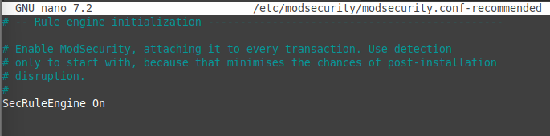

# 🛡️ Implementación de Web Application Firewall (WAF) en Apache

En este apartado se documenta la configuración de un **Web Application Firewall (WAF)** en Apache utilizando **ModSecurity** en un contenedor Docker.

---

## 📌 1. Introducción

Un **Web Application Firewall (WAF)** es una capa de seguridad diseñada para proteger aplicaciones web contra amenazas comunes, como:
- **Inyección SQL**
- **Cross-Site Scripting (XSS)**
- **Falsificación de peticiones entre sitios (CSRF)**
- **Ejecución remota de comandos**
  
En este apartado, configuraremos **ModSecurity** para implementar un WAF en Apache y reforzar la seguridad de nuestras aplicaciones web.

---

## 🚀 2. Instalación y Configuración de ModSecurity

Continuamos desde el terminal donde Apache está corriendo dentro de un contenedor Docker:

### **1️⃣ Instalar ModSecurity**
```bash
apt install -y libapache2-mod-security2
```

### **2️⃣ Habilitar ModSecurity en Apache**
```bash
a2enmod security2
```

### **3️⃣ Copiar la configuración recomendada de ModSecurity**
```bash
cp /etc/modsecurity/modsecurity.conf-recommended ./modsecurity.conf
```

### **4️⃣ Editamos el archivo para activar el motor de reglas:**
```bash
nano /etc/modsecurity/modsecurity.conf
```
  
Buscamos la línea:
```apache
SecRuleEngine DetectionOnly
```
Y la cambiamos a:
```apache
SecRuleEngine On
```
 

### **5️⃣ Aplicar los cambios sobre el servidor Apache, reiniciamos el servicio:**
```bash
service apache2 reload
```

---

## 📌 3. Imagen de Docker WAF

Una vez configurado y probado nuestro WAF con ModSecurity, podemos guardar la imagen y subirla a Docker Hub para reutilizarla en otros entornos.
Primero, identificamos el ID del contenedor donde hemos configurado Apache con ModSecurity.
```bash
sudo docker ps
```
Hacemos un commit del contenedor en una nueva imagen.
```bash
sudo docker commit apache_server pps10219544/imagen_docker:v2
```
  
Esta imagen podemos subirla a Docker Hub, para ello:
- Iniciamos sesión en Docker Hub:
```bash
sudo docker login
```
- Subimos la imagen:
```bash
sudo docker push pps10219544/imagen_docker:v2
```
  
Además, si deseamos descargarnos la imagen en otro sistema:
```bash
sudo docker pull pps10219544/imagen_docker:v2
sudo docker run -d -p 8080:80 -p 8443:443 --name apache_server imagen_docker
```

---

## ✅ 4. Conclusión

Con esta configuración, hemos:  
✔ **Protegido Apache contra ataques comunes** como XSS, SQL Injection y CSRF.  
✔ **Implementado un Web Application Firewall (WAF)** basado en ModSecurity.  
✔ **Creado una imagen Docker con Apache seguro y listo para desplegar en cualquier entorno.**  
  
🔹 **Para reforzar la seguridad, también se recomienda:**
- Ajustar las reglas de ModSecurity según las necesidades de la aplicación.
- Monitorear los logs de Apache para detectar intentos de ataque.
- Configurar ModSecurity en modo "Blocking" para bloquear amenazas automáticamente.
