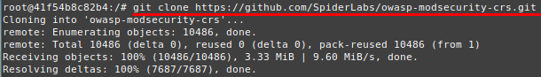
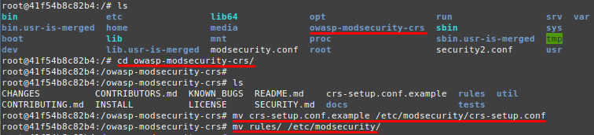
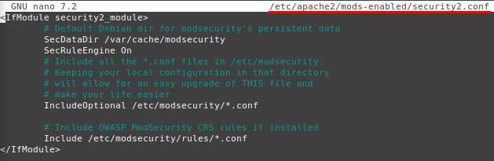
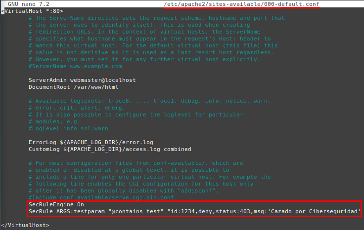
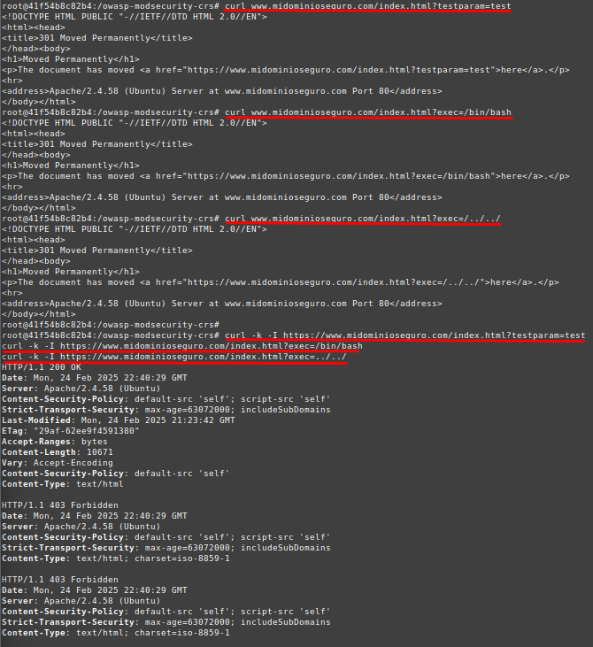

# 🛡️ Implementación de OWASP ModSecurity en Apache

Este apartado documenta la implementación de **OWASP ModSecurity CRS** en Apache para mejorar la seguridad del servidor web y mitigar ataques comunes.

---

## 📌 1. Introducción

**ModSecurity** es un firewall de aplicaciones web (**WAF**) que permite inspeccionar y filtrar el tráfico HTTP, protegiendo el servidor Apache contra amenazas como:

- **Inyección SQL (SQLi)**
- **Cross-Site Scripting (XSS)**
- **Path Traversal**
- **Ejecución remota de comandos (RCE)**

Para mejorar su funcionamiento, se utiliza el **OWASP Core Rule Set (CRS)**, un conjunto de reglas diseñadas para detectar y bloquear ataques web conocidos.

---

## 🚀 2. Instalación y Configuración de ModSecurity con OWASP CRS

Continuamos desde el terminal donde Apache está corriendo dentro de un contenedor Docker:

### **1️⃣ Instalar OWASP CRS**

Instalamos la herramienta git y clonamos el repositorio de OWASP CRS:
```bash
apt install -y git
git clone https://github.com/SpiderLabs/owasp-modsecurity-crs.git
```


### **2️⃣ Configurar OWASP CRS en Apache**

Accedemos al repositorio clonado, copiamos la configuración y las reglas a la configuración de ModSecurity:
```bash
cd owasp-modsecurity-crs/
mv crs-setup.conf.example /etc/modsecurity/crs-setup.conf
mv rules/ /etc/modsecurity/
```


### **3️⃣ Configurar OWASP CRS en Apache**

Editamos la configuración de Apache para cargar OWASP CRS:
```bash
nano /etc/apache2/mods-enabled/security2.conf
```

Añadimos lo siguiente:
```apache
<IfModule security2_module>
    # Directorio para datos persistentes de ModSecurity
    SecDataDir /var/cache/modsecurity
    SecRuleEngine On
    # Cargar configuración de ModSecurity y OWASP CRS
    IncludeOptional /etc/modsecurity/*.conf
    Include /etc/modsecurity/rules/*.conf
</IfModule>
```
  

Guardamos y salimos.

### **4️⃣ ModSecurity con reglas personalizadas**

Editamos el archivo del VirtualHost para agregar una regla personalizada:
```bash
nano /etc/apache2/sites-available/000-default.conf
```
Añadimos la siguiente línea dentro de la configuración:
```bash
SecRuleEngine On
SecRule ARGS:testparam "@contains test" "id:1234,deny,status:403,msg:'Cazado por Ciberseguridad'
```
  

Guardamos y salimos.  
Reiniciamos Apache para aplicar los cambios:
```bash
service apache2 reload
```

## 🛠️ 3. Verificación de ModSecurity y OWASP CRS

Para probar que ModSecurity y OWASP CRS están funcionando, realizamos pruebas con **ataques maliciosos simulados**:
```bash
curl www.midominioseguro.com/index.html?testparam=test
curl www.midominioseguro.com/index.html?exec=/bin/bash
curl www.midominioseguro.com/index.html?exec=/../../
```


---

## 📌 Imagen de Docker OWASP

Una vez configurado y probado nuestro servidor Apache con OWASP ModSecurity CRS, podemos guardar la imagen y subirla a Docker Hub para reutilizarla en otros entornos.
Primero, identificamos el ID del contenedor donde hemos configurado OWASP ModSecurity en Apache.
```bash
sudo docker ps
```
Hacemos un commit del contenedor en una nueva imagen.
```bash
sudo docker commit apache_server pps10219544/imagen_docker:v3
```
  
Esta imagen podemos subirla a Docker Hub, para ello:
- Iniciamos sesión en Docker Hub:
```bash
sudo docker login
```
- Subimos la imagen:
```bash
sudo docker push pps10219544/imagen_docker:v3
```
  
Además, si deseamos descargarnos la imagen en otro sistema:
```bash
sudo docker pull pps10219544/imagen_docker:v3
sudo docker run -d -p 8080:80 -p 8443:443 --name apache_server imagen_docker
```

---

## ✅ 5. Conclusión

Con esta configuración, hemos logrado:  
✔ **Proteger Apache contra ataques web comunes** como XSS, SQL Injection y RCE.  
✔ **Implementar OWASP Core Rule Set (CRS) en ModSecurity**.  
✔ **Bloquear solicitudes maliciosas antes de que lleguen a la aplicación web**.  
✔ **Creado una imagen Docker con Apache seguro y listo para desplegar en cualquier entorno**.
 
🔹 **Recomendaciones adicionales:**
- **Ajustar las reglas de OWASP CRS** según las necesidades de la aplicación.
- **Revisar periódicamente los logs de Apache y ModSecurity** para detectar intentos de ataque.
- **Utilizar ModSecurity en "Blocking Mode"** en entornos de producción para prevenir amenazas en tiempo real.
