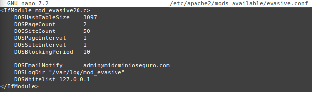
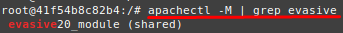
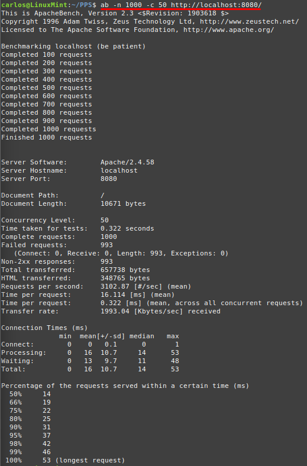

# 🛡️ Implementación de Protección contra Ataques DoS en Apache

En este apartado se documenta la implementación del módulo **mod_evasive** en Apache para proteger el servidor contra ataques de denegación de servicio (**DoS**).

---

## 📌 1. Introducción

Un ataque de **Denegación de Servicio (DoS)** busca saturar un servidor con múltiples solicitudes, dejándolo inaccesible para usuarios legítimos.

**Apache** provee el módulo **mod_evasive**, que detecta patrones de tráfico sospechoso y bloquea las direcciones IP que exceden ciertos umbrales de solicitudes en un período determinado.

Con esta configuración, mejoraremos la resiliencia de nuestro servidor contra este tipo de ataques.

---

## 🚀 2. Instalación y Configuración de mod_evasive

Accedemos al terminal del contenedor de Apache:

```bash
sudo docker exec -it apache_container /bin/bash
```

### **1️⃣ Instalar el módulo mod_evasive**

Durante la instalación de este módulo seguimos las indicaciones.  
```bash
apt install -y libapache2-mod-evasive
```

### **2️⃣ Configurar mod_evasive**

Editamos el archivo de configuración del módulo:
```bash
nano /etc/apache2/mods-available/evasive.conf
```

Añadimos la siguiente configuración:
```apache
<IfModule mod_evasive20.c>
    DOSHashTableSize 3097
    DOSPageCount 5
    DOSSiteCount 50
    DOSPageInterval 1
    DOSSiteInterval 1
    DOSBlockingPeriod 10

    DOSEmailNotify admin@midominioseguro.com
    DOSLogDir "/var/log/mod_evasive"
    DOSWhitelist 127.0.0.1
</IfModule>
```
  

Guardamos los cambios y salimos.

### **3️⃣ Verificación del módulo evasive**

Primero, habilitamos el módulo evasive y reiniciamos el servicio Apache:
```bash
a2enmod evasive
service apache2 restart
```

Y Ejecutamos el siguiente comando para comprobar que mod_evasive está cargado:
```bash
apachectl -M | grep evasive
```
  

### **4️⃣ Crear el directorio de logs**

Para que mod_evasive registre los intentos de ataque, creamos y configuramos su directorio de logs:

```bash
mkdir -p /var/log/mod_evasive
chmod 777 /var/log/mod_evasive
```

---

## 🛠️ 3. Verificación de Protección contra DoS con Apache Bench

Para comprobar que mod_evasive está funcionando correctamente, realizamos una prueba de carga con **Apache Bench**.

Ejecutamos la siguiente prueba de estrés, simulando múltiples solicitudes simultáneas:

```bash
ab -n 1000 -c 50 http://localhost:8080/
```

📌 **Explicación de los parámetros:**
- **`-n 1000`** → Número total de solicitudes a enviar.
- **`-c 50`** → Número de solicitudes concurrentes.

Si la configuración de mod_evasive es correcta, Apache empezará a rechazar solicitudes después de superar el umbral configurado, devolviendo errores **403 Forbidden**.
  

---

## 📌 4. Imagen de Docker DDOS

Una vez configurado y probado nuestro servidor Apache con mod_evasive para mitigar ataques de Denegación de Servicio (DoS), podemos guardar la imagen y subirla a Docker Hub para reutilizarla en otros entornos.  

Primero, identificamos el ID del contenedor donde hemos configurado Apache con mod_evasive:
```bash
sudo docker ps
```

Hacemos un commit del contenedor en una nueva imagen.
```bash
sudo docker commit apache_server pps10219544/imagen_docker:v4
```
  
Esta imagen podemos subirla a Docker Hub, para ello:
- Iniciamos sesión en Docker Hub:
```bash
sudo docker login
```
- Subimos la imagen:
```bash
sudo docker push pps10219544/imagen_docker:v4
```
  
Además, si deseamos descargarnos la imagen en otro sistema:
```bash
sudo docker pull pps10219544/imagen_docker:v4
sudo docker run -d -p 8080:80 -p 8443:443 --name apache_server imagen_docker
```

---

## ✅ 5. Conclusión

Con esta configuración, hemos logrado:  
✔ **Proteger Apache contra ataques de denegación de servicio (DoS).**  
✔ **Bloquear direcciones IP que superen los umbrales configurados.**  
✔ **Monitorear intentos de ataque mediante logs en `/var/log/mod_evasive`.**  
✔ **Creado una imagen Docker con Apache seguro y listo para desplegar en cualquier entorno.**  

🔹 **Recomendaciones adicionales:**
- **Ajustar los umbrales de mod_evasive** según la carga esperada del servidor.
- **Supervisar periódicamente los logs** para detectar posibles ataques.
- **Combinar mod_evasive con otras medidas de seguridad**, como firewalls y configuraciones de red avanzadas.
