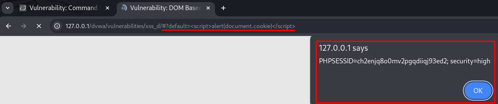

# 🧠 DVWA - XSS (DOM-Based) - High Level

En este repositorio se documenta cómo explotar una vulnerabilidad de **Cross-Site Scripting basada en el DOM (DOM-Based XSS)** en el nivel **High** de **DVWA (Damn Vulnerable Web Application)**.

---

## 🎯 Objetivo

Ejecutar código JavaScript en el navegador del usuario utilizando una vulnerabilidad basada en la manipulación del **Document Object Model (DOM)**, sin intervención del servidor.

> 🔍 Este tipo de XSS no se refleja en la respuesta del servidor, sino que se ejecuta directamente en el navegador usando JavaScript del lado cliente.

---

## 🧠 ¿Qué es DOM-Based XSS?

En DOM-Based XSS, el **navegador** interpreta valores del `document.location`, `document.referrer` o `document.URL`, y los **inyecta directamente** en el HTML sin validación ni sanitización. El atacante aprovecha esto para ejecutar scripts maliciosos.

---

## 🔧 Nivel High en DVWA

### Código JavaScript vulnerable:

```javascript
var pos = document.URL.indexOf("default=") + 8;
var default_value = document.URL.substring(pos);
document.getElementById("default_text").value = default_value;
```

- El valor tras `default=` en la URL es leído e inyectado directamente en el DOM.
- No hay filtrado, escapado ni validación de los datos insertados.

---

## 🛠 Paso a paso para explotar (High Level)

1. Accede al módulo DOM XSS:
```
http://127.0.0.1/dvwa/vulnerabilities/xss_d/
```

### 2. Añade el parámetro `default` con un payload XSS en la URL:

```html
http://127.0.0.1/dvwa/vulnerabilities/xss_d/#?default=<script>alert(document.cookie)</script>
```

3. Resultado

Al cargar la página con ese hash fragment (`#?default=`), el navegador ejecutará directamente el script:

```javascript
alert(document.cookie);
```

 

Esto mostrará una alerta con la cookie actual, confirmando que la inyección fue exitosa.

### 4. Confirmación en Burp Suite

En la pestaña **HTTP History** de Burp Suite, se puede observar que **no se envía el script al servidor**, ya que el ataque se ejecuta totalmente en el lado cliente. La URL vista es:

```
GET /dvwa/vulnerabilities/xss_d/ HTTP/1.1
```

 

El payload está **en el fragmento de la URL** (`#`), y no es enviado en la petición HTTP, lo cual es característico de los ataques DOM-Based.

---

## 🔍 Por qué funciona

- El script vulnerable lee directamente el contenido del fragmento de la URL (`#`) con `document.URL`.
- El valor es inyectado sin sanitización dentro del atributo `value` del input.
- Si se inyecta una etiqueta `<script>`, esta se interpreta y ejecuta.

---

## 🛡️ Recomendaciones de seguridad

- **Evitar el uso de `innerHTML` y `document.write()`** para datos dinámicos.
- Utilizar `textContent` para mostrar texto en lugar de `innerHTML`.
- Escapar correctamente los caracteres especiales (`<`, `>`, `'`, `"`) antes de insertarlos en el DOM.
- Utilizar Content Security Policy (CSP) para prevenir ejecución de scripts inyectados.
- Usar frameworks que integren protección contra XSS, como React, Vue o Angular.

---

## 📚 Recursos

- ▶️ [Vídeo: DVWA DOM-Based XSS (CryptoCat)](https://www.youtube.com/watch?v=X87Ubv-qDm4&list=PLHUKi1UlEgOJLPSFZaFKMoexpM6qhOb4Q&index=11)
- 📝 [Writeup de Aftab Sama - DOM-Based XSS](https://aftabsama.com/writeups/dvwa/dom-based-cross-site-scripting-xss/)
- 📖 [OWASP - DOM-Based XSS](https://owasp.org/www-community/attacks/DOM_Based_XSS)
