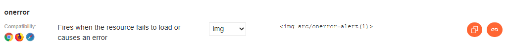
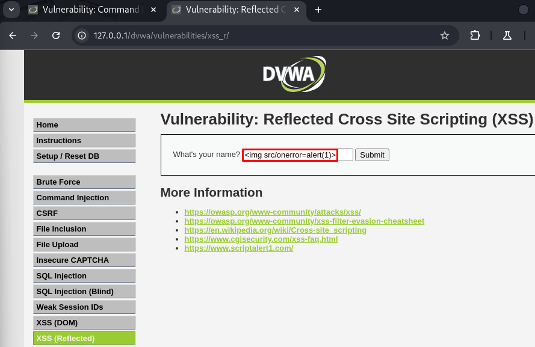
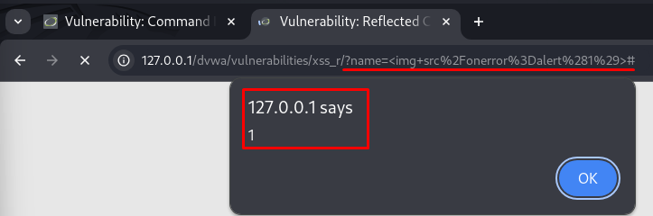
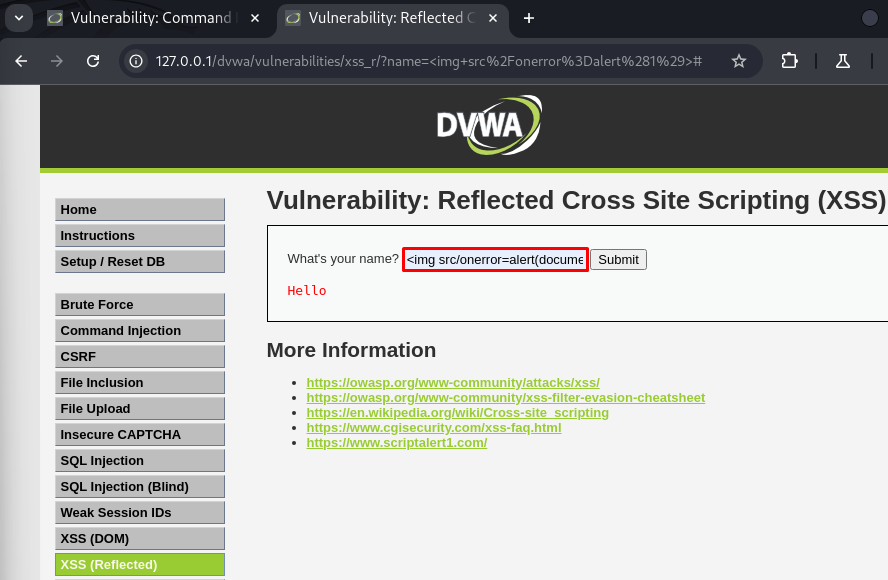
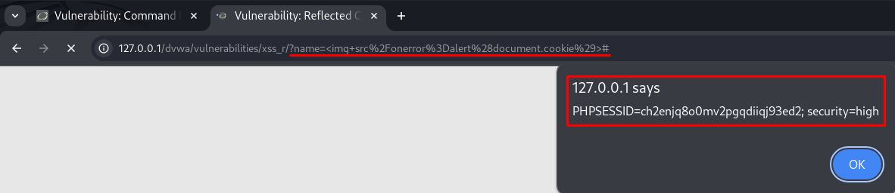

# 🪞 DVWA - XSS (Reflected) - High Level

En este repositorio se explica cómo explotar una vulnerabilidad de tipo **Cross-Site Scripting Reflejado (Reflected XSS)** en el nivel **High** de **DVWA (Damn Vulnerable Web Application)**.

---

## 🎯 Objetivo

Ejecutar un payload JavaScript malicioso que sea **reflejado directamente** por el servidor en la respuesta HTTP y se ejecute en el navegador de la víctima.

---

## 🧠 ¿Qué es Reflected XSS?

El ataque **Reflected XSS** ocurre cuando los datos enviados por el usuario (por ejemplo, mediante la URL) son devueltos directamente por el servidor **sin validación ni escapado**, permitiendo la ejecución de scripts maliciosos.

> A diferencia del XSS (Stored), el código no se almacena en la base de datos, sino que se inyecta y ejecuta en una sola petición.

---

## 🔐 Nivel High en DVWA

- El nivel High utiliza una función de sanitización básica.
- Sin embargo, aún se permite el uso de ciertos vectores si se evaden los filtros correctamente.
- La entrada es vulnerable a XSS si se emplean técnicas de evasión.

---

## 🛠 Paso a paso para explotar (High Level)

### 1. Búsqueda del payload necesario para su ejecución.

Accedemos a la **Cheat Sheet sheet de PortSwigger**:
👉 https://portswigger.net/web-security/cross-site-scripting/cheat-sheet
Y filtramos por `img`, `All events` y `Firefox`.

 

### 2. Introducimos el payload adecuado en el campo de entrada `name`:

```html

```
 

Al ejecutar el payload, se muestra en el navegador esta URL:
```
http://127.0.0.1/dvwa/vulnerabilities/xss_r/?name=
```
 

### 3. Alternativa avanzada para ver cookies de inicio de sesión:

```html

```
 

Al ejecutar el payload, se muestra en el navegador esta URL:
```
http://127.0.0.1/dvwa/vulnerabilities/xss_r/?name=%3Cimg%20src%3Dx%20onerror%3Dalert%281%29%3E
```
 

Al mostrarse la ventana de alerta con la información nos confirma que **el navegador ejecutó el script inyectado**.

---

## 🔍 Por qué funciona

- El valor del parámetro `name` es devuelto directamente en el HTML sin un escapado completo.
- Al inyectar etiquetas HTML/JS, el navegador interpreta el código como parte del documento.

---

## 🛡️ Recomendaciones de seguridad

- Escapar adecuadamente los caracteres HTML (`<`, `>`, `"`, `'`, `&`).
- Utilizar funciones específicas de sanitización (`htmlspecialchars`, `htmlentities` en PHP).
- Implementar Content Security Policy (CSP).
- Validar la entrada en el cliente y en el servidor.

---

## 📚 Recursos

- ▶️ [Vídeo: Reflected XSS High - CryptoCat](https://www.youtube.com/watch?v=qHHADT52L5s&list=PLHUKi1UlEgOJLPSFZaFKMoexpM6qhOb4Q&index=12)
- 📝 [Writeup de Aftab Sama - Reflected XSS](https://aftabsama.com/writeups/dvwa/reflected-cross-site-scripting-xss/)
- 🧾 [Cheat Sheet XSS - PortSwigger](https://portswigger.net/web-security/cross-site-scripting/cheat-sheet)
- 📖 [OWASP - Reflected XSS](https://owasp.org/www-community/attacks/xss/)
