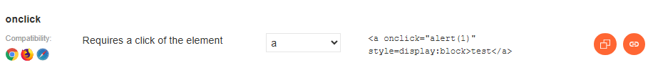
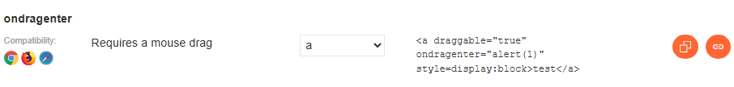
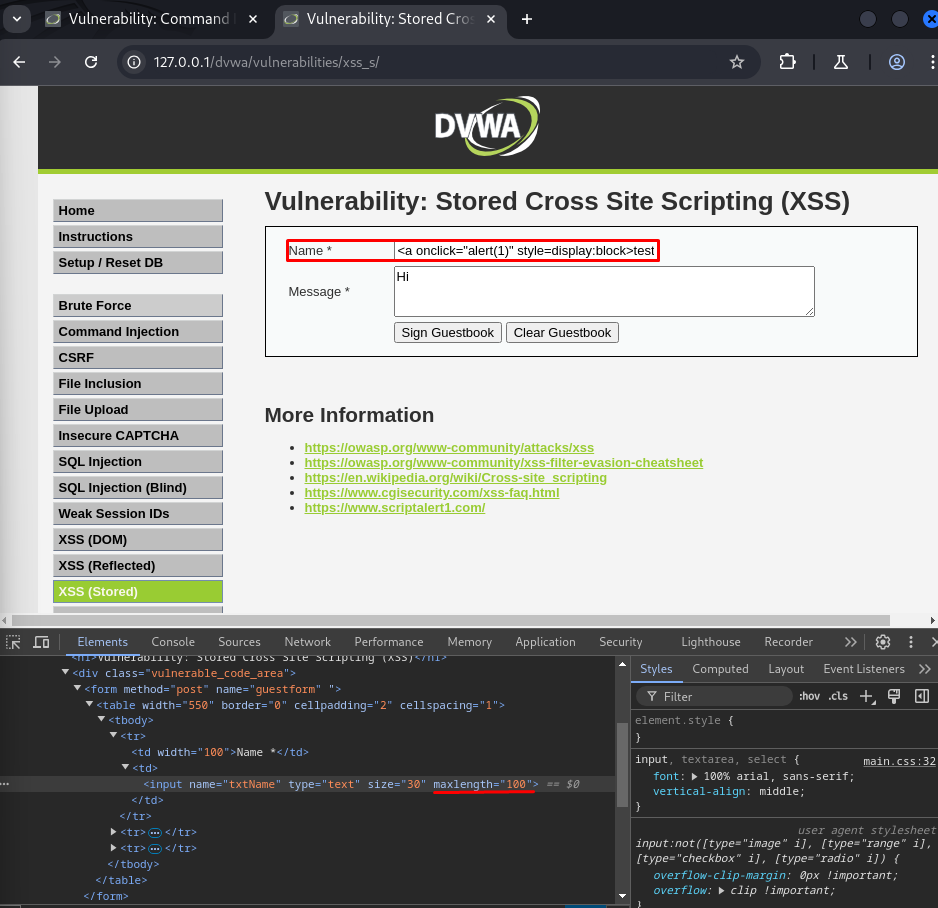
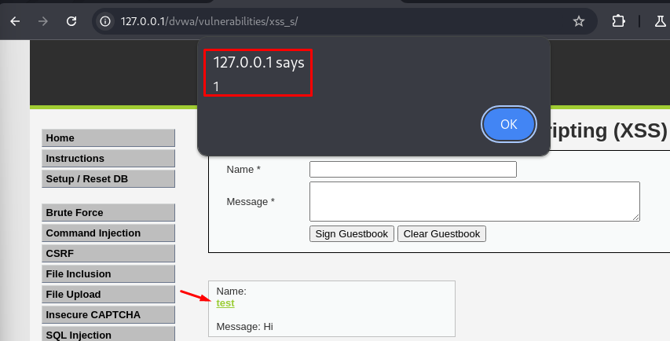
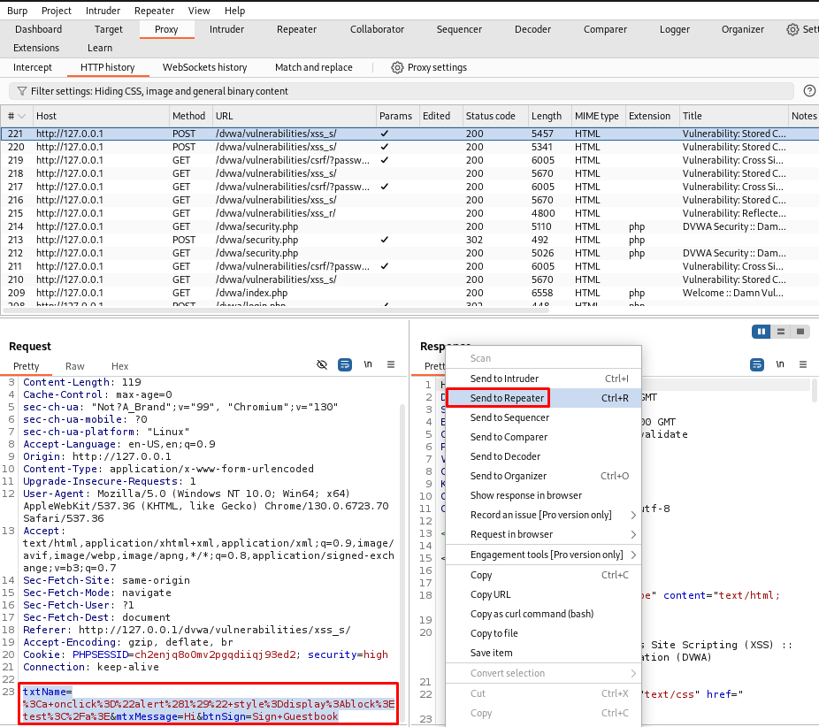
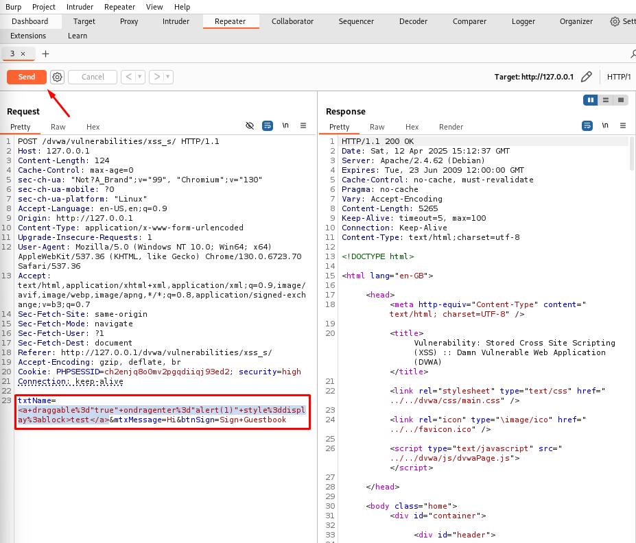
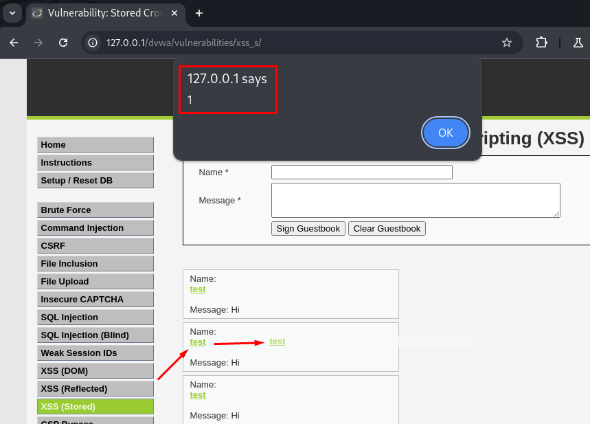

# 💾 DVWA - XSS (Stored) - High Level

En este repositorio se explica cómo explotar una vulnerabilidad de tipo **Cross-Site Scripting Almacenado (Stored XSS)** en el nivel **High** de **DVWA (Damn Vulnerable Web Application)**.

---

## 🎯 Objetivo

Ejecutar un script JavaScript malicioso que se **almacene en la base de datos** y se **ejecute en el navegador** de cualquier usuario que acceda a la página afectada.

---

## 🧐 ¿Qué es Stored XSS?

Es una vulnerabilidad en la que el script inyectado se guarda en el servidor (por ejemplo, en un comentario o formulario) y se ejecuta automáticamente cuando otros usuarios visitan esa sección.

> Es más peligrosa que la reflejada, porque afecta a múltiples usuarios.

---

## 🔐 Nivel High en DVWA

En este nivel, existen mecanismos de filtrado básicos que bloquean los payloads comunes, por lo que es necesario emplear **técnicas de evasón**.

---

## 🛠️ Paso a paso para explotar (High Level)

### 1. Accedemos al módulo:
```
http://127.0.0.1/dvwa/vulnerabilities/xss_s/
```

### 2. Búsqueda del payload necesario para su ejecución.

Accedemos a la **Cheat Sheet sheet de PortSwigger**: 

👉 https://portswigger.net/web-security/cross-site-scripting/cheat-sheet 

Y filtramos por `a`, `All events` y `Firefox`.

#### Este payload nos permite ejecutar una alerta cuando el usuario hace click sobre el texto.
 

#### Este nuevo payload, lanza una alerta cuando se arrastra el texto `test` a otro lugar. 


### 3. Introducimos un payload XSS alternativo evadiendo filtros:
```html
<a onclick="alert(1)" style=display:block>test</a>
```


Damos click en **"Sign Guestbook"** y click sobre `test`.


### 4. Accedemos al **Burp Suite**, buscamos la petición realizada y enviamos esta al **Repeater**.



### 5. Desde el **Repeater**, modificamos la línea seleccionada con el siguiente payload:
```html
<a draggable="true" ondragenter="alert(1)" style=display:block>test</a>
```

### 6. Una vez copiado, lo mantenemos seleccionado, ejecutamos **CTRL + U** y tomará el formato adecuado. 



Una vez añadido el nuevo payload, lo mandamos haciendo click en `Send`.

### 7. Accedemos de nuevo al módulo y vemos que hay una nueva salida.
Arrastramos el texto `test` por la pantalla y salta la alerta.


---

## 🔍 Por qué funciona

- Aunque hay filtros, no bloquean eventos menos comunes como `onclick` o `ondragenter`.
- Se evita el uso directo de etiquetas `<script>` que normalmente estarían bloqueadas.

---

## 🛡️ Recomendaciones de seguridad

- Validar y sanear todo input antes de almacenarlo.
- Escapar caracteres especiales al mostrar datos en el HTML.
- Utilizar `Content-Security-Policy` para evitar ejecución de scripts arbitrarios.
- Aplicar codificación adecuada (`htmlspecialchars` en PHP).

---

## 📚 Recursos

- ▶️ [Video: Stored XSS High - CryptoCat](https://www.youtube.com/watch?v=P1I9UGpGdrU&list=PLHUKi1UlEgOJLPSFZaFKMoexpM6qhOb4Q&index=13)
- 📄 [Writeup de Aftab Sama - Stored XSS](https://aftabsama.com/writeups/dvwa/stored-cross-site-scripting-xss/)
- 🔹 [Cheat Sheet XSS - PortSwigger](https://portswigger.net/web-security/cross-site-scripting/cheat-sheet)
