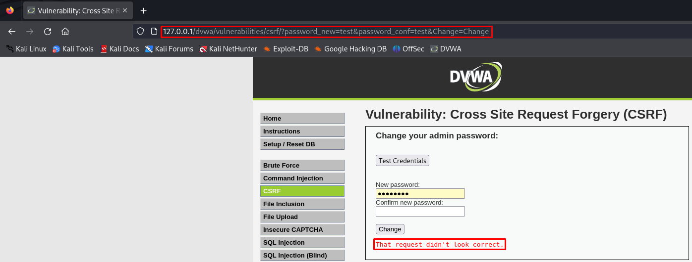
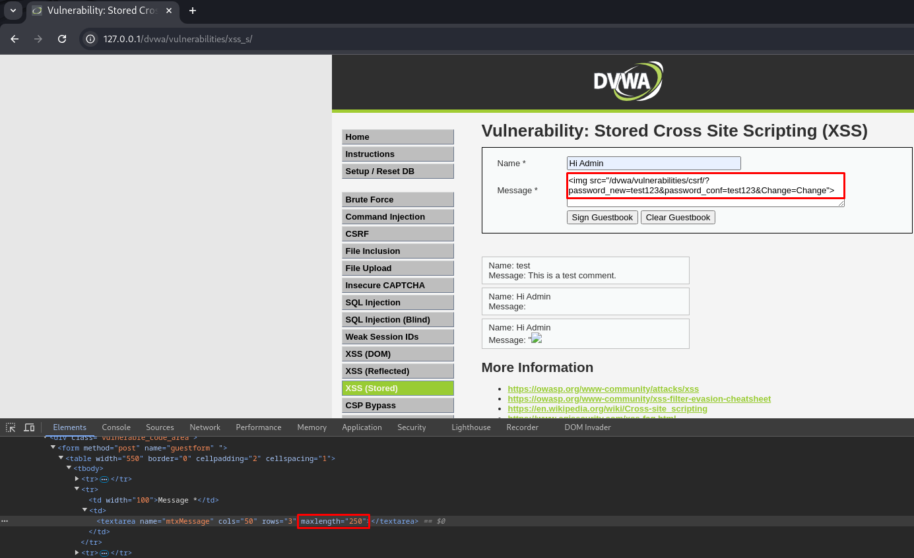
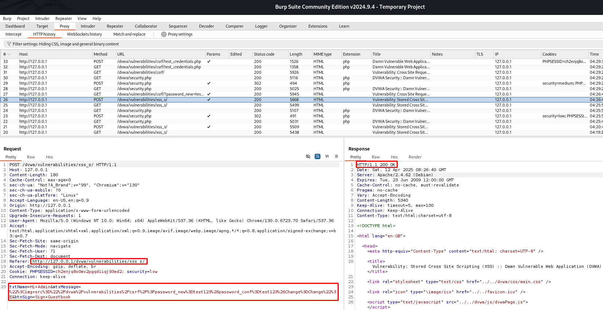
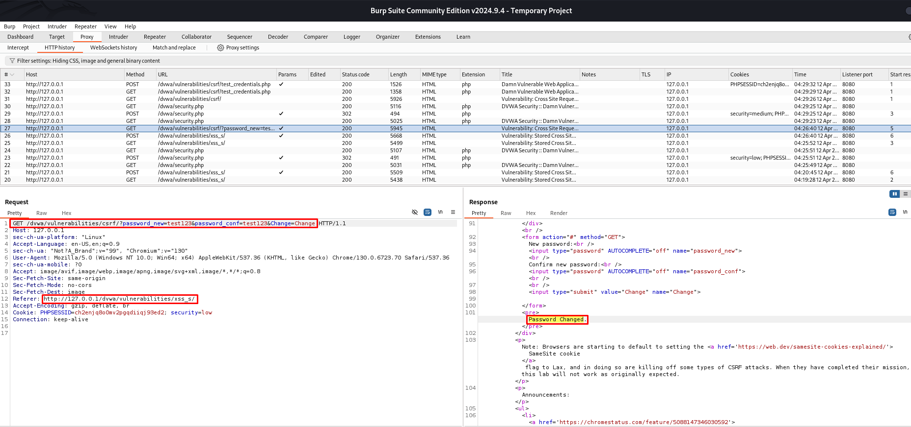
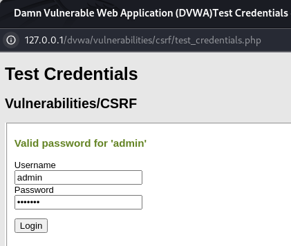

# 🛡️ DVWA - Cross Site Request Forgery (CSRF) - Low y Medium

En este repositorio se explica cómo explotar la vulnerabilidad **CSRF (Cross Site Request Forgery)** en los niveles **Low** y **Medium** dentro de **DVWA (Damn Vulnerable Web Application)**.

---

## 🎯 Objetivo

Realizar un ataque CSRF para **cambiar la contraseña de un usuario autenticado sin su consentimiento**, aprovechando la ausencia o debilidad de protecciones en el formulario vulnerable. Esto se puede lograr mediante técnicas de ingeniería social como enviar un enlace por email o redirigir a la víctima a una página maliciosa.

---

## 🔧 Nivel Low

### 🧪 Vulnerabilidad detectada
- No hay validación de origen ni token CSRF.
- El código fuente `low.php` acepta peticiones GET directamente sin verificar el origen ni incluir ningún token de seguridad.
- Además, al inspeccionar el botón Test Credentials, se observa un script que abre una ventana con `test_credentials.php`, útil para comprobar si la contraseña ha sido modificada.
- Usando **Burp Suite**, es posible interceptar y observar una petición GET.

---

### 🛠 Paso a paso

#### 1. Inspeccionamos el elemento desde el apartado de CSRF y vemos que el botón **Test Credentials** ejecuta un script, el cual verifica si la contraseña se ha cambiado correctamente.

 
   
#### 2. Damos click en **Test Credentials** y vemos que podemos comprobar la contraseña del usuario *admin* y su contraseña por defecto *password*.

 

#### 3. Cambiamos la contraseña, introduciendo esta dos veces, y damos click en **Change**.
#### 4. Vemos con la herramienta **Burp Suite** que en la petición GET podemos ver una URL desde donde se puede cambiar la contraseña.
```php
GET /dvwa/vulnerabilities/csrf/?password_new=test&password_conf=test&Change=Change
```

 

#### 5. Copiamos esta URL y la pegamos sobre nuestro navegador.

 

#### 6. Realizamos cambios de la contraseña a *test123* desde la URL.

 

#### 7. Comprobamos que esta contraseña ha sido cambiada al haber modificado la URL y accedido al sitio web.

 


✅ **Exploit exitoso**: la contraseña cambia sin interacción del usuario.

---

## 🔧 Nivel Medium

### 🧪 Vulnerabilidad detectada
- El código `medium.php` realiza una validación del `HTTP_REFERER`, exigiendo que el origen de la petición sea el mismo dominio que el del servidor `SERVER_NAME`.
- Esto impide que ataques externos funcionen directamente, pero se puede **bypassear usando una vulnerabilidad de tipo XSS almacenado**.

### 🛠 Paso a paso (XSS + CSRF combinados)

#### 1. Creamos el archivo `exploit.html` con el siguiente contenido:

```html
<html>
  <body>
    <form action="http://127.0.0.1/dvwa/vulnerabilities/csrf/" method="GET">
      New password:<br />
      <input type="hidden" AUTOCOMPLETE="off" name="password_new" value="test" /><br />
      Confirm new password:<br />
      <input type="hidden" AUTOCOMPLETE="off" name="password_conf" value="test" /><br />
      <input type="hidden" value="Change" name="Change" />
    </form>
    <script>
      document.forms[0].submit();
    </script>
  </body>
</html>
```

#### 2. Intentamos ejecutar este exploit en el Navegador firefox.

```html
firefox exploit.html
```

Sin embargo, la salida no es la esperada, ya que no se modifica la contraseña del usuario.



#### 3. Ahora bajamos la seguridad a *Low* de nuevo, accedemos al apartado **XSS (Stored)** e inspeccionamos esta página, donde aumentaremos el valor de `MaxLength` a 250 para poder introducir el siguiente código en la sección *message*:

```html

```



#### 4. El administrador, al visitar la sección del libro de visitas (`XSS Stored`), ejecutará la petición hacia la ruta CSRF. El referer será el propio DVWA, por lo tanto, **el filtro de origen en Medium no bloqueará la petición**.



En la siguiente petición vemos como la contraseña es cambiada desde la sección XSS_S.



#### 5. Verificamos el cambio con `Test Credentials`.



✅ **Exploit exitoso**: el uso de XSS para forzar una petición interna permite superar el control del `HTTP_REFERER`.

📌 **Nota técnica:** aunque parezca una protección, el referer es manipulable o predecible en ciertos contextos. No es una defensa efectiva por sí sola.

---

## ⚠️ Recomendaciones de seguridad

Para prevenir ataques CSRF:

- Usar tokens CSRF únicos por sesión y validados en el servidor.
- Verificar cabeceras de origen (`Origin` o `Referer`).
- No permitir cargas de archivos ejecutables.
- Aplicar SameSite en cookies para restringir su envío.
- Rechazar peticiones GET para cambios sensibles como contraseñas.
- Separar correctamente los contextos de entrada de datos para prevenir XSS.

---

## 📚 Recursos

- 🔗 [Writeup de Aftab Sama sobre CSRF](https://aftabsama.com/writeups/dvwa/cross-site-request-forgery-csrf/)
- ▶️ [Vídeo tutorial de CSRF en DVWA](https://www.youtube.com/watch?v=Nfb9E8MJv6k&list=PLHUKi1UlEgOJLPSFZaFKMoexpM6qhOb4Q&index=4)
- 📖 [OWASP - CSRF](https://owasp.org/www-community/attacks/csrf)
