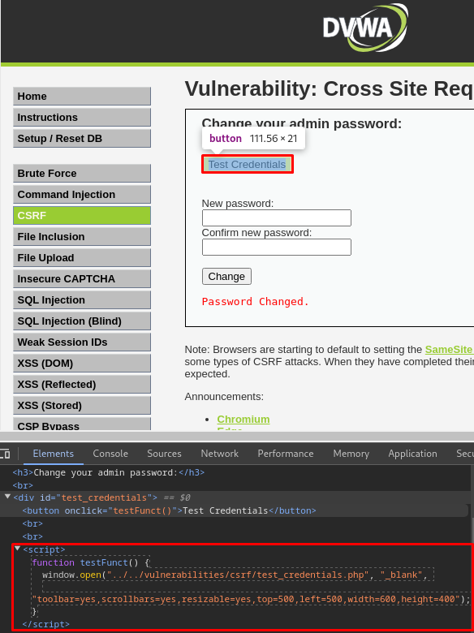
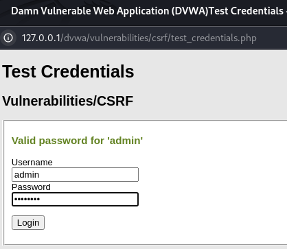
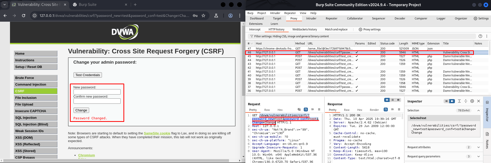
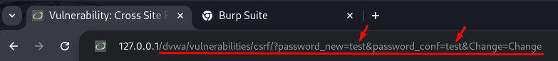
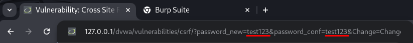
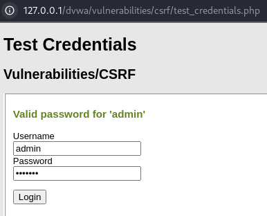

# 🛡️ DVWA - Cross Site Request Forgery (CSRF) - Low y Medium

En este repositorio se explica cómo explotar la vulnerabilidad **CSRF (Cross Site Request Forgery)** en los niveles **Low** y **Medium** dentro de **DVWA (Damn Vulnerable Web Application)**.

---

## 🎯 Objetivo

Realizar un ataque CSRF para **cambiar la contraseña de un usuario autenticado sin su consentimiento**, aprovechando la ausencia o debilidad de protecciones en el formulario vulnerable. Esto se puede lograr mediante técnicas de ingeniería social como enviar un enlace por email o redirigir a la víctima a una página maliciosa.

---

## 🔧 Nivel Low

### 🧪 Vulnerabilidad detectada
- No hay validación de origen ni token CSRF.
- El código fuente `low.php` acepta peticiones GET directamente sin verificar el origen ni incluir ningún token de seguridad.
- Además, al inspeccionar el botón Test Credentials, se observa un script que abre una ventana con `test_credentials.php`, útil para comprobar si la contraseña ha sido modificada.
- Usando `Burp Suite`, es posible interceptar y observar una petición GET.

### 🛠 Paso a paso

1. Inspeccionamos el elemento desde el apartado de CSRF y vemos que el botón **Test Credentials** ejecuta un script, el cual verifica si la contraseña se ha cambiado correctamente.

 
   
2. Damos click en **Test Credentials** y vemos que podemos comprobar la contraseña del usuario *admin* y su contraseña por defecto *password*.

 

3. Cambiamos la contraseña, introduciendo esta dos veces, y damos click en **Change**.
4. Vemos con la herramienta **Burp Suite** que en la petición GET podemos ver una URL desde donde se puede cambiar la contraseña.
```php
GET /dvwa/vulnerabilities/csrf/?password_new=test&password_conf=test&Change=Change
```

```html
GET /dvwa/vulnerabilities/csrf/?password_new=test&password_conf=test&Change=Change
```

 

5. Copiamos esta URL y la pegamos sobre nuestro navegador.

 

6. Realizamos cambios de la contraseña a *test123* desde la URL.

 

7. Comprobamos que esta contraseña ha sido cambiada al haber modificado la URL y accedido al sitio web.

 


✅ **Exploit exitoso**: la contraseña cambia sin interacción del usuario.

---

## 🔧 Nivel Medium

### 🧪 Vulnerabilidad detectada
- El servidor verifica el **referer** o el origen de la petición.
- Una petición externa directa no funciona, pero se puede subir el exploit usando otra vulnerabilidad.

### 🛠 Paso a paso (CSRF + File Upload)

1. Cambiar el archivo `csrf.html` a `csrf.php`.
2. Establecer el nivel de seguridad en **Low** temporalmente.
3. Ir a la sección **File Upload** de DVWA.
4. Subir el archivo `csrf.php` al servidor.

```html
<html>
  <body>
    <script>history.pushState('', '', '/')</script>
    <form action="http://127.0.0.1/dvwa/vulnerabilities/csrf/" method="GET">
      <input type="hidden" name="password_new" value="mediumpass" />
      <input type="hidden" name="password_conf" value="mediumpass" />
      <input type="hidden" name="Change" value="Change" />
      <input type="submit" value="Submit request" />
    </form>
    <script>
      document.forms[0].submit();
    </script>
  </body>
</html>
```

5. Una vez subido, visitar la URL del archivo, por ejemplo:

```
http://127.0.0.1/dvwa/hackable/uploads/csrf.php
```

✅ **Exploit exitoso**: al alojar el archivo en el mismo servidor, se evita el filtro del referer y se cambia la contraseña.

---

## ⚠️ Recomendaciones de seguridad

Para prevenir ataques CSRF:

- Usar tokens CSRF únicos por sesión y validados en el servidor.
- Verificar cabeceras de origen (`Origin` o `Referer`).
- No permitir cargas de archivos ejecutables.
- Aplicar SameSite en cookies.

---

## 📚 Recursos

- 🔗 [Writeup de Aftab Sama sobre CSRF](https://aftabsama.com/writeups/dvwa/cross-site-request-forgery-csrf/)
- ▶️ [Vídeo tutorial de CSRF en DVWA](https://www.youtube.com/watch?v=Nfb9E8MJv6k&list=PLHUKi1UlEgOJLPSFZaFKMoexpM6qhOb4Q&index=4)
- 📖 [OWASP - CSRF](https://owasp.org/www-community/attacks/csrf)

---

## 👨‍💻 Autor

**Carlos Peris Navarro**  
Estudiante de Ciberseguridad

