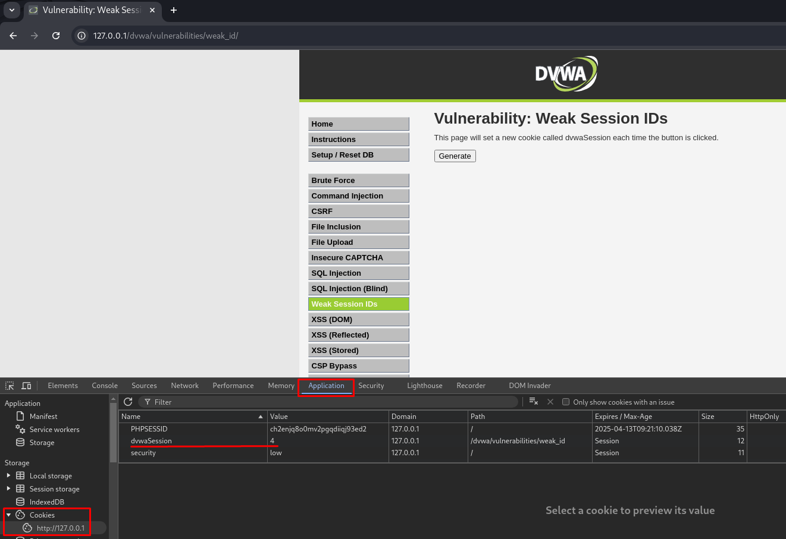
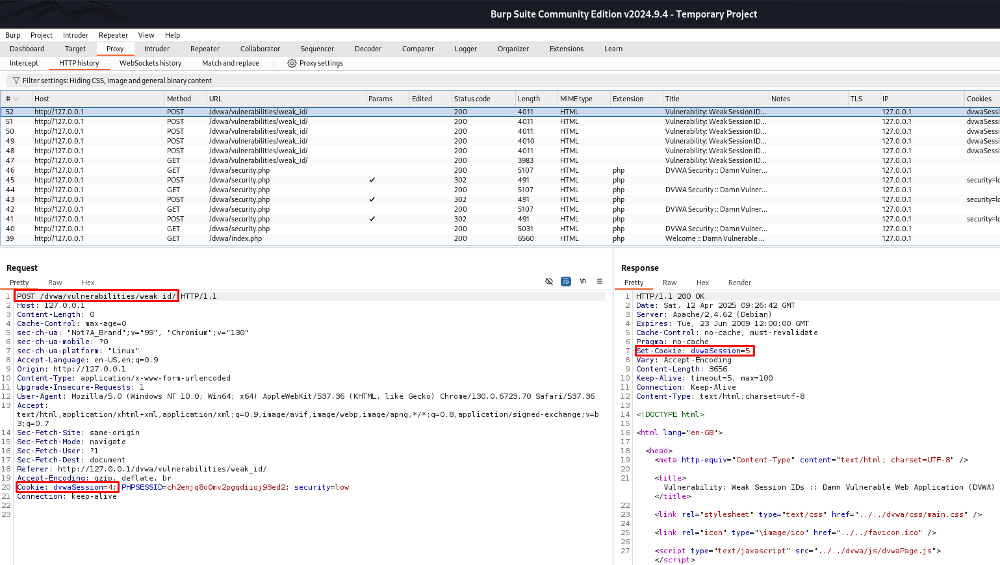
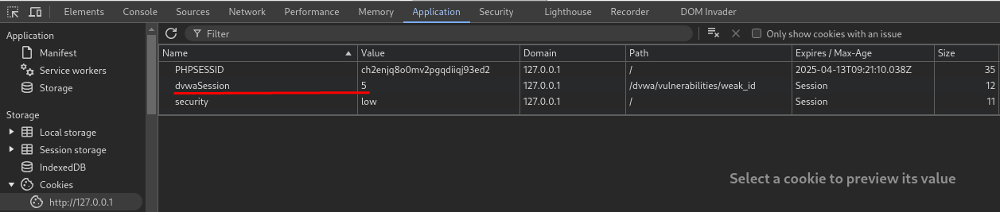

# 🛡️ DVWA - Weak Session IDs (Low y Medium Level)

En este repositorio se explica cómo explotar la vulnerabilidad de Identificadores de **Weak Session IDs** en los niveles **Low** y **Medium** de **DVWA (Damn Vulnerable Web Application)**.

---

## 🎯 Objetivo

Detectar si los identificadores de sesión generados por la aplicación web son predecibles o poco seguros, lo cual podría permitir a un atacante secuestrar sesiones válidas mediante ataques de **session fixation** o **session prediction**.

---

## 🔧 Nivel Low

### 🔍 Análisis

- Al iniciar sesión o actualizar la página, se genera un nuevo ID de sesión (`PHPSESSID`).
- Este ID es **corto y completamente predecible**, por ejemplo:

```
PHPSESSID = 1
PHPSESSID = 2
PHPSESSID = 3
```

- Usando herramientas como **Burp Suite**, puedes observar que estos valores se incrementan de manera secuencial.

### 🛠 Paso a paso

1. Iniciar Burp Suite y activar el proxy.
  
2. Realizar múltiples inicios de sesión o clickar en `Generate` varias veces y anotar los `PHPSESSID`.

 

3. Observar la cookie `PHPSESSID` en la pestaña **HTTP History**.

 

4. Comprobamos que siguen un patrón predecible y se va incrementa el ID en 1.

 


✅ **Conclusión:** el atacante podría predecir un valor de sesión válido y usarlo para secuestrar la sesión de otro usuario.

---

## 🔧 Nivel Medium

### 🔍 Análisis

- En este nivel, los valores de `PHPSESSID` ya no son números secuenciales simples.
- Aunque son **más largos y menos evidentes**, siguen sin ser generados con un nivel de entropía suficientemente alto.
- No hay regeneración de ID tras iniciar sesión, lo que permite ataques de **session fixation**.

### 🛠 Paso a paso

1. Iniciar sesión con un usuario y capturar el valor de la cookie `PHPSESSID`.
2. Cerrar sesión y volver a iniciar, comprobando si el nuevo ID sigue un patrón reconocible.
3. Enviar manualmente una cookie con un `PHPSESSID` predecible para simular un intento de secuestro de sesión.

Ejemplo de cookie:
```
Cookie: PHPSESSID=abc123
```

✅ **Conclusión:** aunque más difícil que en `Low`, sigue siendo vulnerable a ataques si el atacante puede predecir o fijar la sesión.

---

## 🛡️ Recomendaciones de seguridad

- Generar IDs de sesión con alta entropía y aleatoriedad (por ejemplo, usando `openssl_random_pseudo_bytes`).
- Regenerar el ID de sesión al iniciar sesión exitosamente (`session_regenerate_id()`).
- Establecer banderas de seguridad en cookies:
  - `HttpOnly`
  - `Secure`
  - `SameSite=Strict`
- Aplicar tiempo de expiración a las sesiones.

---

## 📚 Recursos

- ▶️ [Vídeo tutorial: Weak Session IDs en DVWA](https://www.youtube.com/watch?v=xzKEXAdlxPU&list=PLHUKi1UlEgOJLPSFZaFKMoexpM6qhOb4Q&index=10)
- 📖 [OWASP - Session Management Cheat Sheet](https://cheatsheetseries.owasp.org/cheatsheets/Session_Management_Cheat_Sheet.html)
