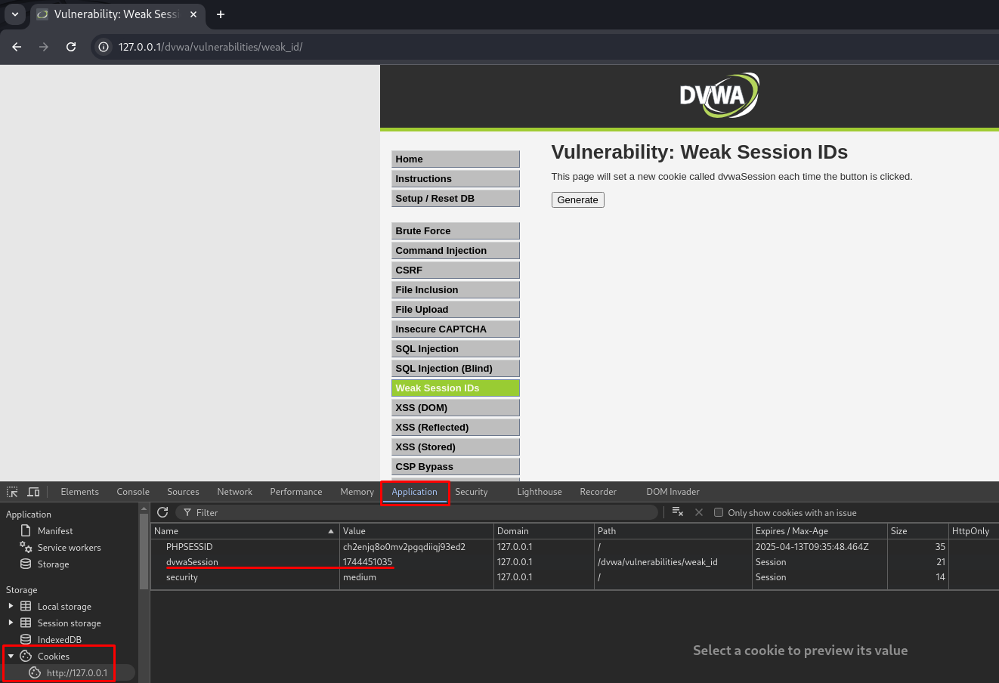
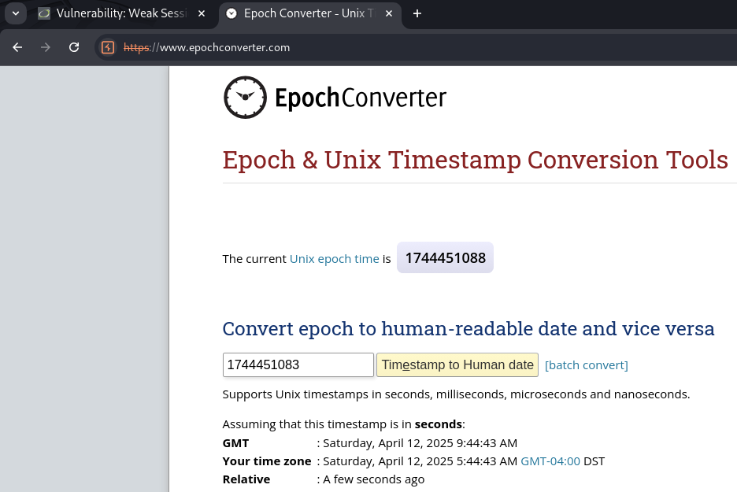

# 🛡️ DVWA - Weak Session IDs (Low y Medium Level)

En este repositorio se explica cómo explotar la vulnerabilidad de Identificadores de **Weak Session IDs** en los niveles **Low** y **Medium** de **DVWA (Damn Vulnerable Web Application)**.

---

## 🎯 Objetivo

Detectar si los identificadores de sesión generados por la aplicación web son predecibles o poco seguros, lo cual podría permitir a un atacante secuestrar sesiones válidas mediante ataques de **session fixation** o **session prediction**.

---

## 🔧 Nivel Low

### 🔍 Análisis

- Al iniciar sesión o actualizar la página, se genera un nuevo ID de sesión (`PHPSESSID`).
- Este ID es **corto y completamente predecible**, como por ejemplo:

```
PHPSESSID = 1
PHPSESSID = 2
PHPSESSID = 3
```

- Usando herramientas como **Burp Suite**, puedes observar que estos valores se incrementan de manera secuencial.

### 🛠 Paso a paso

#### 1. Iniciamos Burp Suite y activamos el proxy.
  
#### 2. Realizamos múltiples inicios de sesión o clickamos en `Generate` varias veces y nos fijamos en los `PHPSESSID`.

 

#### 3. Observamos la cookie `PHPSESSID` en la pestaña **HTTP History**.

 

#### 4. Comprobamos que siguen un patrón predecible y se va incrementa el ID en 1.

 


✅ **Conclusión:** el atacante podría predecir un valor de sesión válido y usarlo para secuestrar la sesión de otro usuario.

---

## 🔧 Nivel Medium

### 🔍 Análisis

- En este nivel, el identificador vulnerable no es `PHPSESSID`, sino una cookie llamada `dvwaSession`.
- Este valor es generado a partir del **epoch time** (timestamp UNIX actual), como puede comprobarse en herramientas como [EpochConverter](https://www.epochconverter.com/).
- Cada vez que se pulsa "Generate", se asigna un nuevo `dvwaSession` con la hora actual en segundos:

```
dvwaSession=1744451034
```

- Esto hace que el valor sea **altamente predecible** si el atacante conoce el instante aproximado en que fue generado.

### 🛠 Paso a paso

#### 1. Pulsar el botón **Generate** en DVWA dentro del apartado `Weak Session IDs`.
#### 2. Desde **Inspeccionar elemento** podemos ver el valor de la cookie `dvwaSession`.

  

#### 3. Acceder a [epochconverter.com](https://www.epochconverter.com/) para comprobar que coincide con la hora actual en formato UNIX.

 

#### 4. En **Burp Suite > Repeater**, enviamos solicitudes desde el botón `Send` y observamos que el valor de la cookie `dvwaSession` se va ajustando a la hora según **UNIX Epoch time**.

 

✅ **Conclusión:** aunque no es secuencial como en `Low`, el uso del tiempo como identificador sigue siendo predecible y vulnerable.

---

## 🛡️ Recomendaciones de seguridad

- Generar IDs de sesión con alta entropía y aleatoriedad (por ejemplo, usando `openssl_random_pseudo_bytes`).
- Regenerar el ID de sesión al iniciar sesión exitosamente (`session_regenerate_id()`).
- Establecer banderas de seguridad en cookies:
  - `HttpOnly`
  - `Secure`
  - `SameSite=Strict`
- Aplicar tiempo de expiración a las sesiones.
- Evitar valores basados en fecha/hora o secuencias simples como ID de sesión.

---

## 📚 Recursos

- ▶️ [Vídeo tutorial: Weak Session IDs en DVWA](https://www.youtube.com/watch?v=xzKEXAdlxPU&list=PLHUKi1UlEgOJLPSFZaFKMoexpM6qhOb4Q&index=10)
- 📖 [OWASP - Session Management Cheat Sheet](https://cheatsheetseries.owasp.org/cheatsheets/Session_Management_Cheat_Sheet.html)
