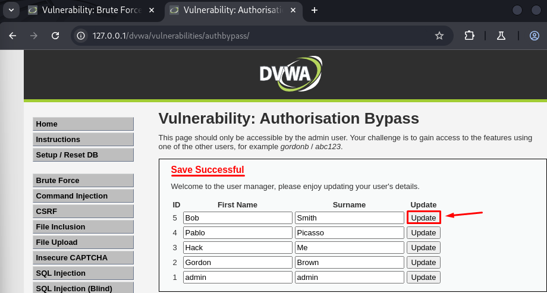
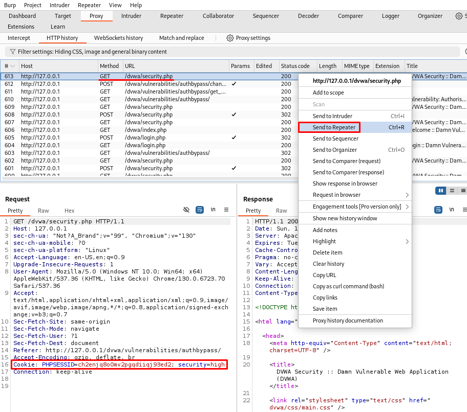
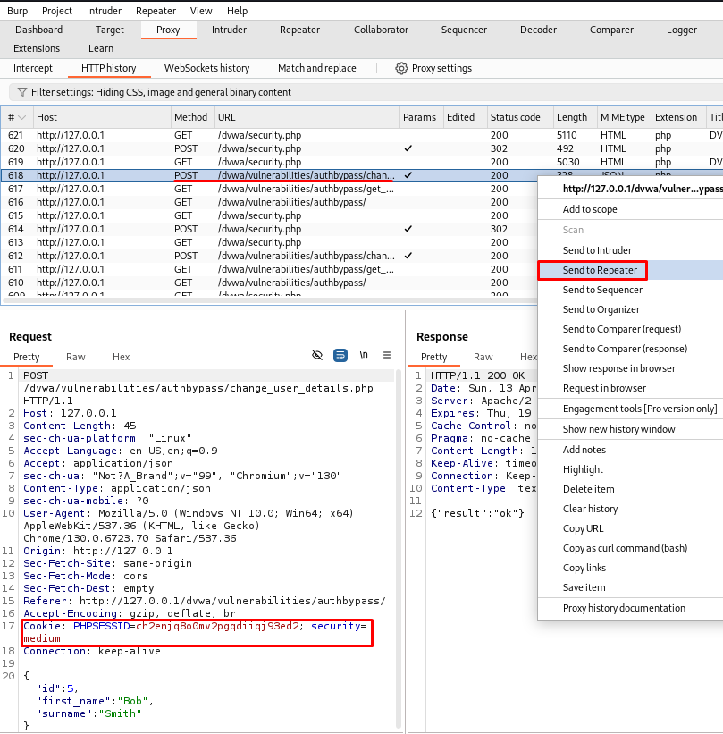
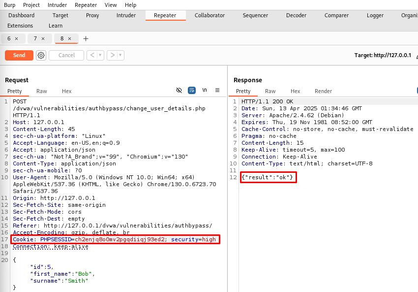
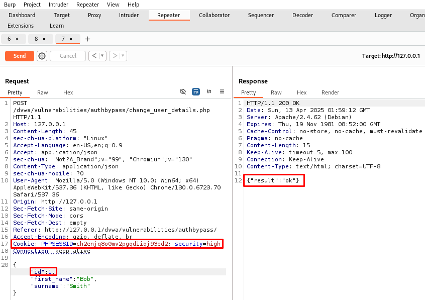
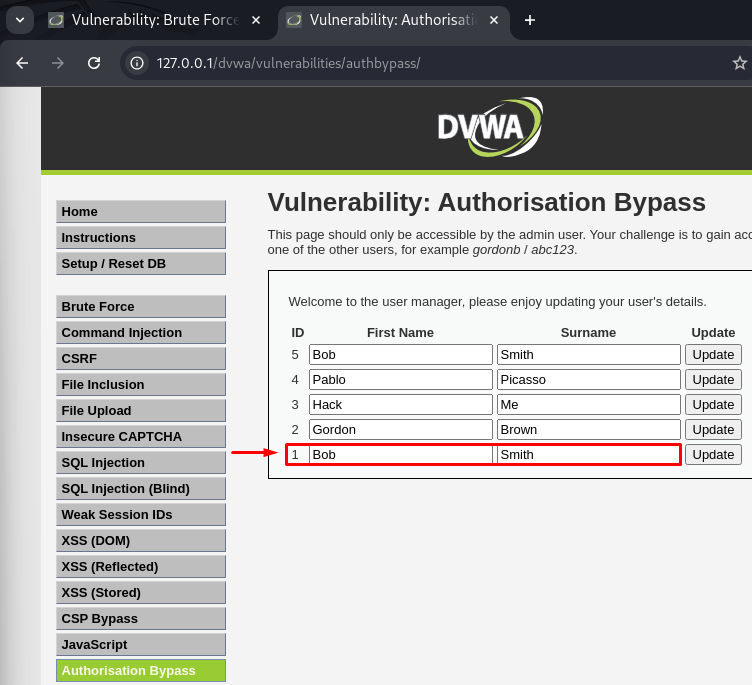

# 🚫 DVWA - Authorization Bypass (High Level)

En este repositorio se describe cómo explotar la vulnerabilidad **Authorization Bypass** en el nivel de seguridad **High** en **DVWA (Damn Vulnerable Web Application)**, accediendo a recursos protegidos sin la debida autorización.

---

## 🎯 Objetivo

Modificar la información de otro usuario sin contar con privilegios administrativos, demostrando que el control de autorización se puede omitir manipulando la solicitud HTTP.

---

## 🔧 Paso a paso para explotar

### 1. Acceder al módulo **Authorization Bypass**
```
http://127.0.0.1/dvwa/vulnerabilities/authbypass/
```

### 2. Actualizamos los detalles del usuario `Bob / Smith` haciendo el click `Update`.



### 3. Accedemos a **Burp Suite**, vamos a la pestaña **Proxy > HTTP history**.
  - Localizamos la petición `GET /dvwa/security.php`.
  - Mandamos la petición al **Repeater**.
  - Copiamos la línea entera de las **Cookie**.
```
Cookie: PHPSESSID=ch2enjq8o0mv2pgqdiiqj93ed2; security=high
```



### 4. Localizamos la petición `POST /dvwa/vulnerabilities/authbypass/change_user_details.php`.
  - Mandamos la petición al **Repeater**.

 

### 5. Sustituimos la línea entera de las **Cookie**, por la copiada anteriormente.
   - Hacemos clic en **Send** y verificamos que la respuesta incluya:
     ```json
     {"result":"ok"}
     ``` 

> Con esto comprobamos que funciona correctamente y ya podemos modificar detalles del *admin*.

### 6. Modificamos el ID del usuario.
   - En la pestaña **Repeater**, modificamos el valor del parámetro `"id"` a `1`, que corresponde al usuario *admin*:
     ```json
     {
       "id": 1,
       "first_name": "Bob",
       "surname": "Smith"
     }
     ```


### 7. **Enviamos la solicitud con sesión estándar**
   - Nos aseguramos de que la cookie usada es la copiada anteriormente del nivel **High**.
   - Hacemos clic en **Send** y verificamos que la respuesta incluye:
     ```json
     {"result":"ok"}
     ```
   - Accedemos de nuevo al módulo de **Authorization Bypass** y vemos los cambios aplicados sin permiso del usuario *admin*.



---

## ✅ Resultado

A pesar de no tener privilegios administrativos, se ha logrado modificar la información del usuario `admin` enviando una solicitud manipulada directamente al endpoint, omitiendo los controles de autorización del frontend.

---

## 🛡️ Recomendaciones de mitigación

- Implementar control de acceso a nivel de backend, validando que el usuario tenga permisos para modificar el recurso.
- Utilizar tokens CSRF únicos por usuario y validar la identidad en el servidor.
- Registrar y monitorear cambios de datos sensibles.

---

## 📚 Recursos

- [Video guía CryptoCat - Authorization Bypass](https://www.youtube.com/watch?v=Qcgu34eWQa4&list=PLHUKi1UlEgOJLPSFZaFKMoexpM6qhOb4Q&index=16)
