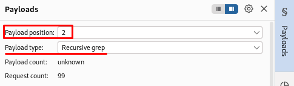
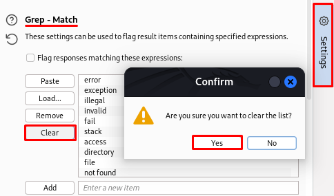
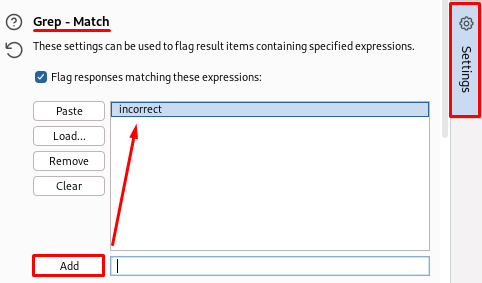
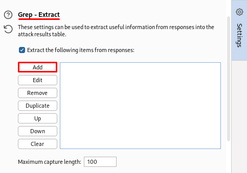
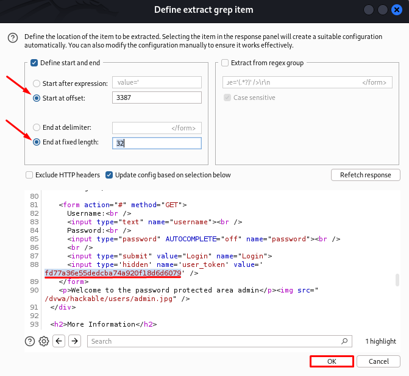
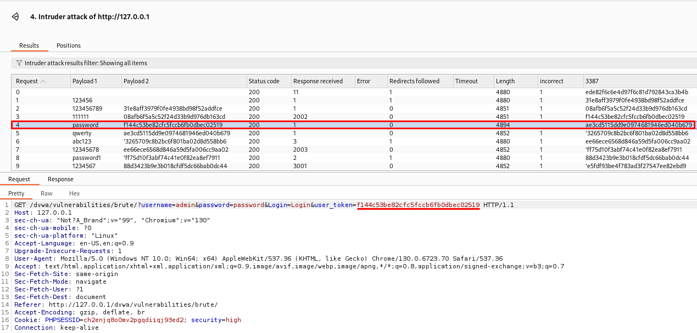
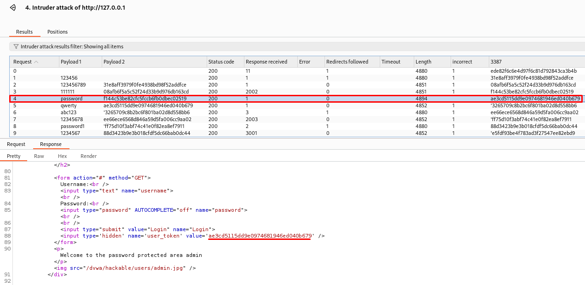

# 🔓 DVWA - Brute Force (High Level)

En este repositorio se detalla el proceso de explotación de la vulnerabilidad **Brute Force** en el nivel de seguridad **High** dentro de **DVWA (Damn Vulnerable Web Application)**. Esta práctica demuestra cómo un atacante puede automatizar intentos de acceso con múltiples contraseñas usando Burp Suite.

---

## 🎯 Objetivo

Explotar la funcionalidad de login para obtener acceso no autorizado a una cuenta válida mediante un ataque de fuerza bruta automatizado, superando mecanismos de protección como el uso de tokens dinámicos.

---

## 🧪 Paso a paso para explotar

### 1. Accedemos al módulo:
```
http://127.0.0.1/dvwa/vulnerabilities/brute/
```

### 2. Iniciamos sesión con el usuario `admin` y la contraseña `password`.
 

### 3. Accedemos al **Burp Suite**, seleccionamos la petición del log in y la mandamos al **Intruder**.
```
GET /dvwa/vulnerabilities/brute/?username=admin&password=password&Login=Login&user_token=TOKEN
```
Este token cambia con cada intento, por lo que debe ser dinámicamente actualizado en cada petición. 
 

### 4. Accedemos al **Intruder**, y nos disponemos a configurar el **Payload**:
 - Seleccionamos el ataque como **Pitchfork**, es decir, combina los dos payloads en paralelo.
 - Cambiamos el valor de la `password` y marcamos este y el valor de `user_token` con `§`.

### 5. Configuración del **Payload 1**:
 - Tipo de payload: **Simple list**.
 - Click en `Load...` y cargamos el fichero *darkweb2017-top100.txt*, el cual contiene 100 contraseñas.
 

### 6. Configuración del **Payload 2**:
 - Tipo de payload: **Recursive grep**.
 
 - Accedemos al apartado de **Settings**.

#### **Configuración de Grep - Match**
  - Click en `Clear`, eliminamos todos los filtros.
  
  - Añadimos la opción **incorrect**, para distinguir respuestas erróneas, y damos click en `Add`.
  

#### **Configuración de Grep - Extract**
  - Click en `Add`.
   
  
  - Bajamos en el código, hasta que encontramos el valor del `user_token` y lo seleccionamos.
  - Cambiamos ambas opciones a `Start at offset: 3387` y `End at fixed length: 32`.
   

#### **Configuración de Redirections**
   - Activamos `Always` para seguir redirecciones automáticamente.

### 7. Lanzamos el ataque haciendo click en **Start Attack**.

### 8. **Visualización del ataque - Request**
 - **Payload 1** contiene contraseñas de prueba.
 - **Payload 2** contiene los tokens `user_token` generados dinámicamente en cada intento.
 - El request nº 4 destaca porque no contiene el texto *incorrect*, y el tamaño de la respuesta es mayor (4894). Esto indica un **login exitoso**.
 - El token válido en ese intento fue `f144c53be82cf5fcf6bf6db0bec02519`.
  

### 9. **Visualización del ataque - Response**
 - El código HTML renderiza el mensaje: “*Welcome to the password protected area admin*”.
 - También se carga la imagen: `dvwa/hackable/users/admin.jpg`.
 - Esto valida que la combinación `admin:password` fue aceptada y el token utilizado era correcto.
  

---

## 📌 Resultado

Se ha identificado correctamente la contraseña válida para el usuario `admin`, superando la protección con tokens dinámicos del nivel High.

---

## 🛡️ Recomendaciones de mitigación

- Implementar protección contra ataques de fuerza bruta (ej. bloqueo tras varios intentos).
- Usar mecanismos robustos de gestión de tokens con caducidad y validación en servidor.
- Registrar e investigar accesos sospechosos.

---

## 📚 Recursos

- [Video guía CryptoCat - Brute Force](https://www.youtube.com/watch?v=SWzxoK6DAE4&list=PLHUKi1UlEgOJLPSFZaFKMoexpM6qhOb4Q&index=2)
- [Aftab Sama Writeup - Brute Force](https://aftabsama.com/writeups/dvwa/brute-force/)
- [Repositorio - *darkweb2017-top100.txt*](https://github.com/noder-ss/my-wordlists/blob/prod1/darkweb2017-top100.txt/)
