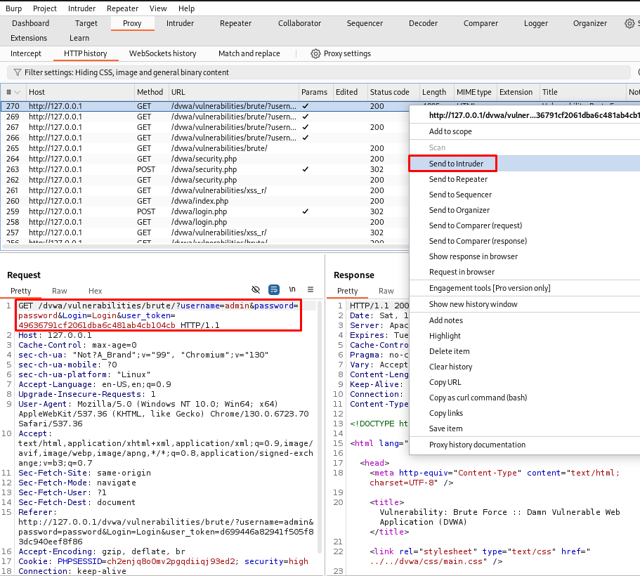
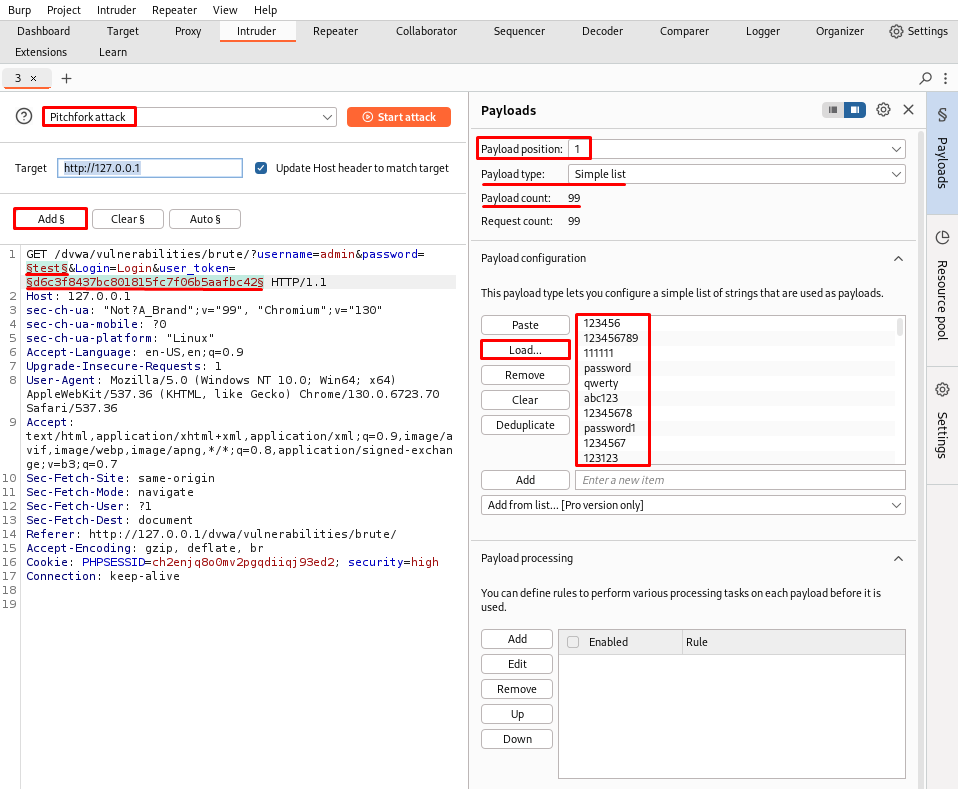

# 🔓 DVWA - Brute Force (Nivel High)

Este documento detalla el proceso de explotación de la vulnerabilidad **Brute Force** en el nivel de seguridad **High** dentro de **DVWA (Damn Vulnerable Web Application)**. Esta práctica demuestra cómo un atacante puede automatizar intentos de acceso con múltiples contraseñas usando Burp Suite.

---

## 🎯 Objetivo

Explotar la funcionalidad de login para obtener acceso no autorizado a una cuenta válida mediante un ataque de fuerza bruta automatizado, superando mecanismos de protección como el uso de tokens dinámicos.

---

## 🧪 Paso a paso para explotar

### 1. Accedemos al módulo:
```
http://127.0.0.1/dvwa/vulnerabilities/brute/
```

### 2. Iniciamos sesión con el usuario `admin` y la contraseña `password`.

 

### 3. Accedemos al **Burp Suite**, seleccionamos la petición del log in y la mandamos al **Intruder**.
```
GET /dvwa/vulnerabilities/brute/?username=admin&password=password&Login=Login&user_token=TOKEN
```
Este token cambia con cada intento, por lo que debe ser dinámicamente actualizado en cada petición. 
 

### 4. Accedemos al **Intruder**, y nos disponemos a configurar el **Payload**:
 - Seleccionamos el ataque como **Pitchfork**, es decir, combina los dos payloads en paralelo.
 - Cambiamos el valor de la `password` y marcamos este y el valor de `user_token` con `§`.

### 5. Configuración del **Payload 1**:
 - Tipo de payload: **Simple list**
 - Click en `Load...` y cargamos el fichero *darkweb2017-top100.txt*, el cual contiene 100 contraseñas.

 

### 6. Configuración del **Payload 2**:

   - Para el `user_token`, usamos la opción **Grep - Extract** para actualizarlo dinámicamente.

### 6. **Configuración de Grep - Match y Extract**
   - En **Grep - Match**, eliminamos todos los filtros y añadimos el texto `incorrect` para distinguir respuestas erróneas.
   - En **Grep - Extract**, añadimos:
     - Inicio tras `value='`
     - Longitud fija: 32 caracteres (hash del `user_token`)

### 7. **Configuración de redirecciones**
   - En la pestaña **Redirections**, activamos `Always` para seguir redirecciones automáticamente.

### 8. **Ejecución del ataque**
   - Pulsamos **Start Attack**.
   - En la tabla de resultados, se detecta el intento exitoso porque:
     - El campo `incorrect` está vacío.
     - El contenido de la respuesta cambia e incluye la ruta `/dvwa/hackable/users/admin.jpg`.

---

## 📌 Resultado

Se ha identificado correctamente la contraseña válida para el usuario `admin`, superando la protección con tokens dinámicos del nivel High.

---

## 🛡️ Recomendaciones de mitigación

- Implementar protección contra ataques de fuerza bruta (ej. bloqueo tras varios intentos).
- Usar mecanismos robustos de gestión de tokens con caducidad y validación en servidor.
- Registrar e investigar accesos sospechosos.

---

## 📚 Recursos

- [Video guía CryptoCat - Brute Force](https://www.youtube.com/watch?v=SWzxoK6DAE4&list=PLHUKi1UlEgOJLPSFZaFKMoexpM6qhOb4Q&index=2)
- [Aftab Sama Writeup - Brute Force](https://aftabsama.com/writeups/dvwa/brute-force/)
- [Repositorio - *darkweb2017-top100.txt*](https://github.com/noder-ss/my-wordlists/blob/prod1/darkweb2017-top100.txt/)
