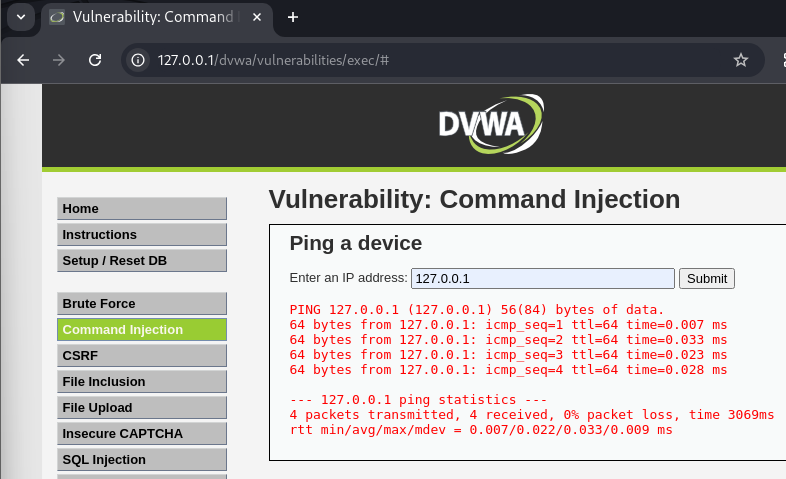
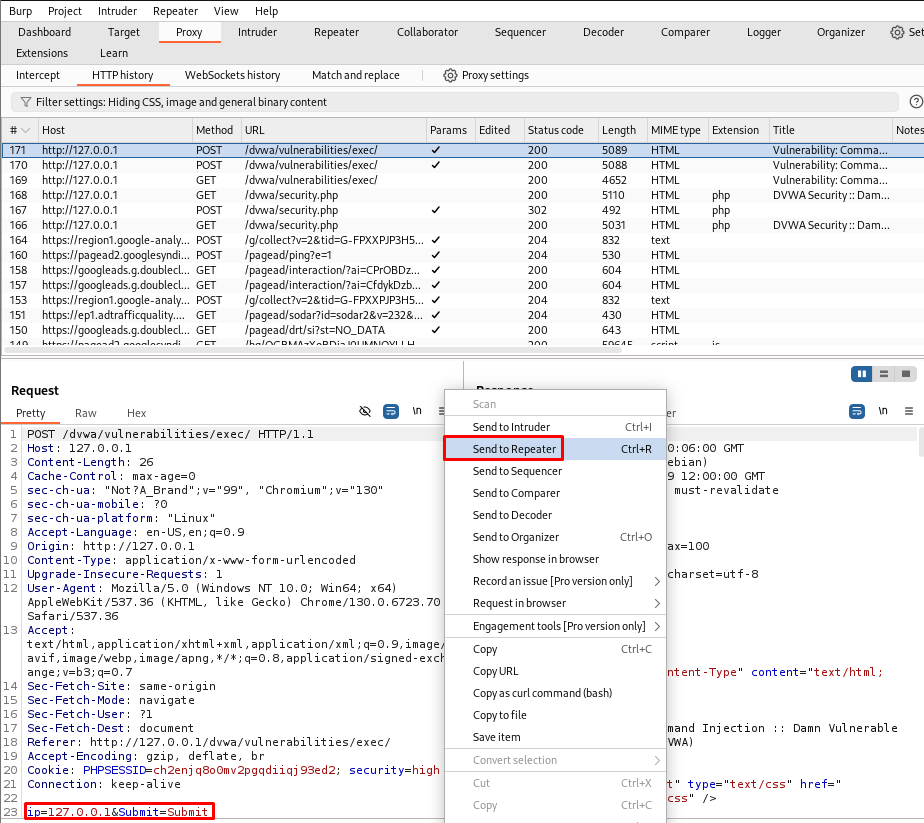
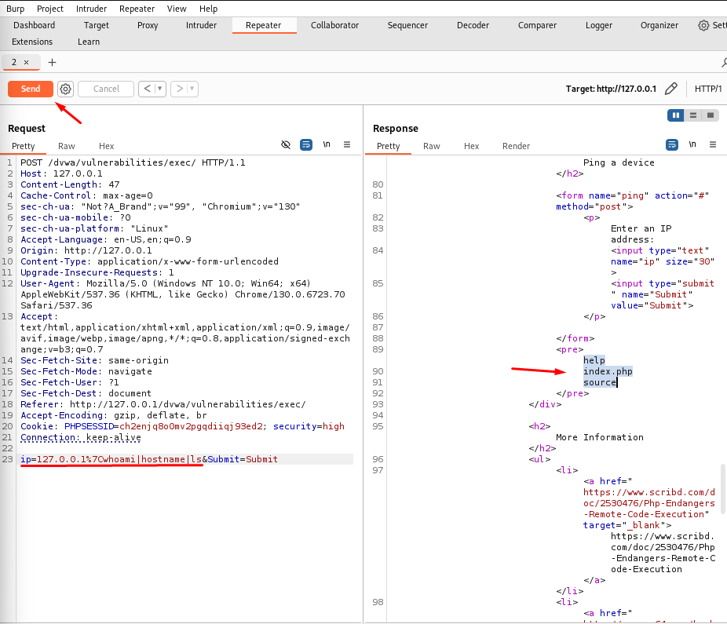
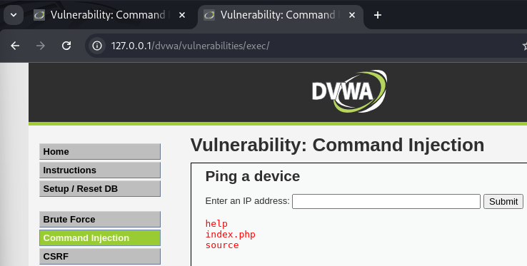

# 💣 DVWA - Command Injection (High Level)

En este repositorio se explica cómo explotar  la vulnerabilidad de **Command Injection** en el nivel **High** de **DVWA (Damn Vulnerable Web Application)**.

---

## 🎯 Objetivo

Ejecutar comandos arbitrarios del sistema en el servidor utilizando como vector de entrada el parámetro del formulario de búsqueda de IP, y saltarse las protecciones del nivel High.

---

## 🧠 Análisis técnico

En este nivel, el código fuente utiliza una función de validación para **filtrar caracteres especiales** que suelen ser usados en ataques de inyección de comandos (como `&`, `;`, `|`, etc.).

```php
$target = $_REQUEST[ 'ip' ];
$substitutions = array(
    '&&' => '',
    ';'  => '',
    '|'  => '',
    '`'  => '',
    '||' => '',
);

$target = str_replace( array_keys( $substitutions ), $substitutions, $target );
```

- Se permite la ejecución del comando `ping`, pero se limpia la entrada antes de concatenarla.
- Los caracteres de escape simples son eliminados, pero **no se filtran subprocesos (`$()`)**.

---

## 🛠 Paso a paso para explotar (High Level)

### 1. Escribimos la dirección IP de localhost `127.0.0.1` y le damos a `Submit`.

 

### 2. Accedemos a la petición generada en el **Burp Suite** y mandamos esta petición al **Repeater**

 

### 3. En el **Repeater**, modificamos el parámetro `ip` de este modo:

```bash
ip=127.0.0.1|whoami|hostname|ls&Submit=Submit
```
Esto inyecta los comandos `whoami`, `hostname` y `ls` a través del operador `|`.

### 4. Mandamos la petición desde el botón `Send` y observamos que se han listado archivos o rutas como:
```
help
index.php
source
```

 

### 5. Desde la respuesta en Burp, hacemos clic derecho ➜ **Show response in browser** y copiamos la URL en el navegador.
```
http://burpsuite/show/9/tmvb3too00ggczu5xefnohefoo9gkgiz
```

### 6. Lo pegamos en el navegador y vemos directamente la salida de los comandos inyectados.

 

✅ **Exploit exitoso:** el filtro de seguridad fue evadido gracias al uso del operador `|`.

---

## 🔍 Por qué funciona

- El filtro borra símbolos como `;`, `&&`, pero **no valida correctamente `|`**, ni escapa la entrada como argumento de shell.
- Se ejecuta internamente con algo similar a:

```bash
ping -c 4 $target
```

Si `$target` es `127.0.0.1|ls`, la shell lo interpreta como:

```bash
ping -c 4 127.0.0.1 | ls
```

---

## 🛡️ Recomendaciones de seguridad

- Nunca concatenar comandos del sistema con entrada del usuario.
- Utilizar funciones como `escapeshellcmd()` y `escapeshellarg()` si es estrictamente necesario.
- Validar los datos del usuario con **whitelisting** (por ejemplo, solo permitir IPs con regex).
- Usar `proc_open()` o `shell_exec()` con máxima precaución, y con contexto controlado.
- Aislar la ejecución de comandos en contenedores o entornos restringidos (sandboxing).

---

## 📚 Recursos

- ▶️ [Vídeo: DVWA Command Injection (High Level)](https://www.youtube.com/watch?v=WiqRvlN_UIU&list=PLHUKi1UlEgOJLPSFZaFKMoexpM6qhOb4Q&index=4)
- 📝 [Writeup de Aftab Sama](https://aftabsama.com/writeups/dvwa/command-injection/)
- 📖 [OWASP - Command Injection](https://owasp.org/www-community/attacks/Command_Injection)
